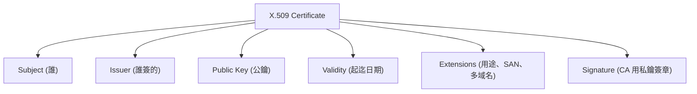
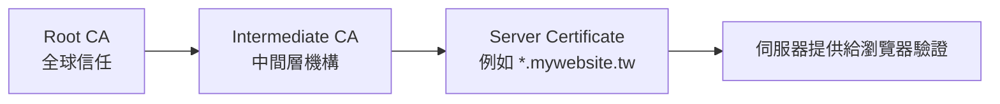
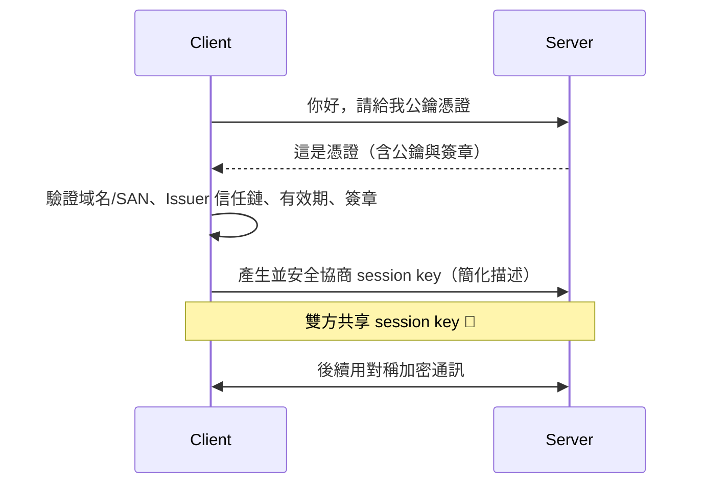
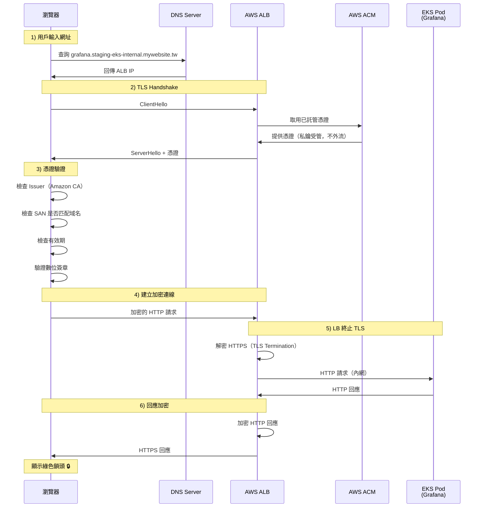
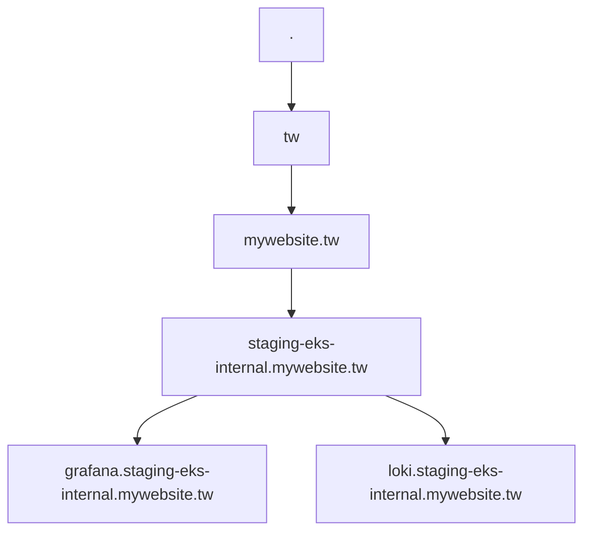
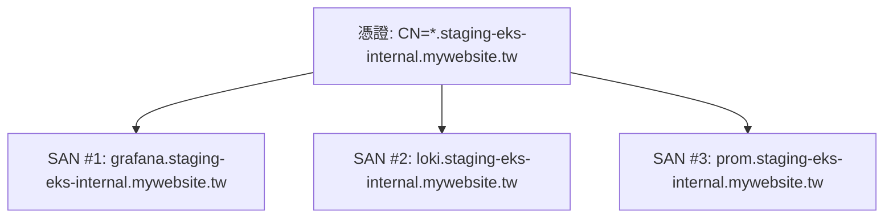
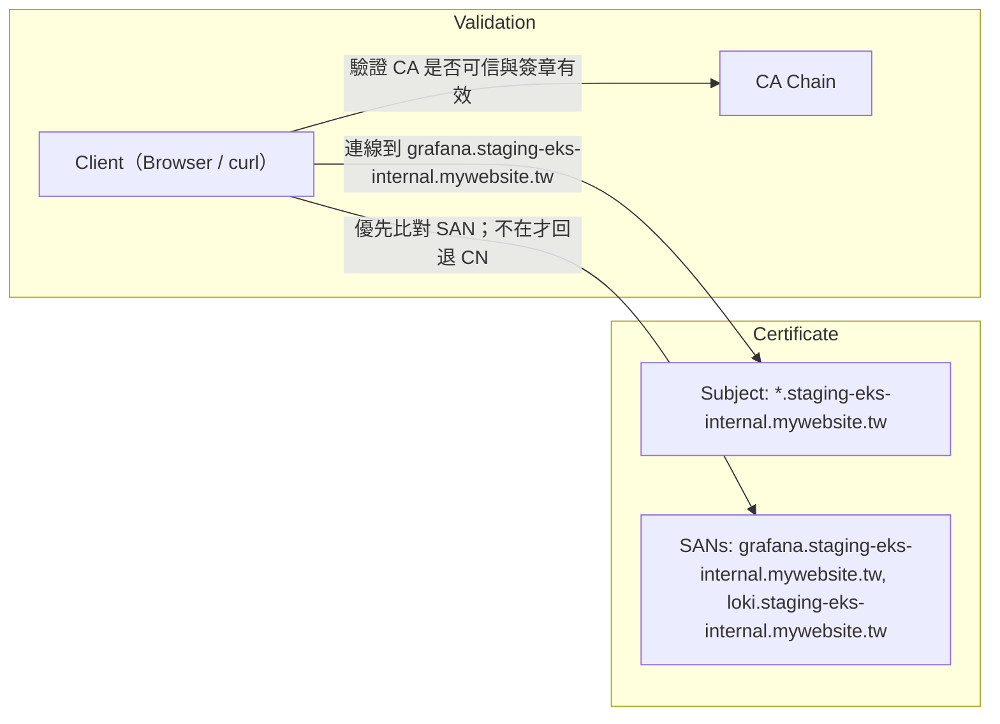

# 憑證與 TLS 一頁筆記（Certificate, TLS/HTTPS）

## TL;DR
- 憑證是由受信任的第三方 CA 簽發的「數位身分證」，解決兩件事：你是誰（身分驗證）與怎麼安全說話（加密通訊）。
- 瀏覽器會驗證：域名是否匹配、CA 是否可信（信任鏈）、憑證是否過期、簽章是否有效。
- Wildcard 只匹配一層子域（RFC 6125），例如：`*.example.com` 可用於 `www.example.com`、`admin.example.com`，但不能用於 `example.com` 或 `api.v1.example.com`。

---

## 1. 情境（WHY）
想像你開一家咖啡店（你的網站），客人（瀏覽器）進門前會要求看「營業執照」（憑證）。這張執照是政府（CA）核發的，保證你是真的那家咖啡店，而不是隔壁裝成你的詐騙店。

拿到執照後，客人會核對：
1) 名字對不對（網域匹配）
2) 發照機構靠不靠譜（根憑證信任鏈）
3) 有沒有過期

一切無誤後，雙方會用「對稱加密」建立安全通道，開始講悄悄話。

---

## 2. 第一層：核心概念（WHAT）
「憑證是一份數位身分證明，讓瀏覽器知道『你真的是你』。它由被信任的第三方（CA）簽發，用來建立安全加密通道。」

把「憑證 (Certificate)」想像成「身分證 + 門鎖鑰匙」組合包，要解決兩個核心問題：
- 你是誰？（身分驗證 Authentication）
- 我們怎麼安全地對話，不被竊聽？（資料加密 Encryption）

參與者：
- 使用者/瀏覽器：想確認網站是否真實，並安全通訊。
- 網站伺服器（例如 mywebsite.tw）：需要證明「我就是這個域名」。
- CA（數位政府，如 DigiCert、Let’s Encrypt、Amazon Trust Services）：簽發身分證，為網站身分背書。OS/瀏覽器內建受信任 CA 清單。

---

## 3. 第二層：工作原理（HOW-Concepts）

### 3.1 非對稱加密（公鑰與私鑰）
- 公鑰（Public Key）：可公開，用來把資料鎖起來（加密）。
- 私鑰（Private Key）：絕不外流，用來打開被鎖的資料（解密）。

兩大用途：
- 加密通訊：用公鑰加密後，只有握有私鑰者能解密。
- 數位簽章（Digital Signature）：用私鑰簽名文件，任何人都可用對應公鑰驗證，確保「確是你發的」且「內容未被竄改」。

### 3.2 憑證的真面目（X.509）
憑證是一個檔案，主要包含：
- 伺服器的公鑰
- 伺服器身分（最重要為域名，如 `*.mywebsite.tw`）
- CA 的數位簔章（CA 用它的私鑰對「公鑰 + 身分」簽名，證明此公鑰屬於該網站）

---

## 4. 第三層：技術細節（X.509、信任鏈、握手）

### 4.1 X.509 結構總覽

| 欄位 | 意義 |
| --- | --- |
| Subject | 網站身分，如 `CN=*.mywebsite.tw` |
| Issuer | 簽發機構，如 `Amazon Trust Services`、`Let’s Encrypt` |
| Public Key | 伺服器公開金鑰 |
| Signature | CA 私鑰簽出的摘要，保證憑證未被竄改且屬於此 Issuer |
| SAN (Subject Alternative Name) | 多域名，例：`grafana.mywebsite.tw`、`loki.mywebsite.tw` |

### 4.2 憑證信任鏈（Certificate Chain）

- Root CA 內建於 OS/瀏覽器（如 Amazon、DigiCert、Let’s Encrypt）
- 中繼（Intermediate）負責分層管理與控風險
- 伺服器通常出示「Server + Intermediate」，瀏覽器沿鏈驗證至 Root

### 4.3 TLS 握手（簡化版）

註：現代 TLS 多採用 ECDHE 等「前向保密」(PFS) 機制協商會話金鑰，上圖為概念化簡版。

### 4.4 真實案例（ALB/ACM/EKS）

---

## 5. Wildcard 憑證與匹配規則（RFC 6125）

### 5.1 直覺示意

DNS 名稱自右向左解析：
- `.tw` 是 TLD
- `mywebsite.tw` 是根域名
- `staging-eks-internal.mywebsite.tw` 是其子域
- `grafana.staging-eks-internal.mywebsite.tw` 更下一層

規則（RFC 6125）：
- “*” 只能出現在最左邊的 label，且僅匹配「單一層」label。
- 因此 `*.example.com`：
  - ✅ `www.example.com`、`admin.example.com`
  - ❌ `example.com`（根域名）
  - ❌ `api.v1.example.com`（兩層）

### 5.2 FQDN 與 SAN
- FQDN：完整指定的域名，直到根（.），如 `grafana.staging-eks-internal.mywebsite.tw.`（末尾的「.」可省略展示）
- SAN（Subject Alternative Name）：讓一張憑證同時認得多個 FQDN

瀏覽器驗證順序（現代行為）：
- 優先比對 SAN
- 不在 SAN 時才回退至 Subject CN
- 檢查 wildcard 是否正確覆蓋當前主機名

---

## 6. 實戰測試（自我檢核）

### 測試 1：你能解釋嗎？
- 為什麼需要 HTTPS？
- 憑證如何證明網站身分？
- 為什麼 `*.mywebsite.tw` 不能覆蓋 `api.www.mywebsite.tw`？
- 為什麼 ACM 憑證必須與 ALB 在同一個 Region？

### 測試 2：情境問答

Q1: 憑證 `*.example.com`，以下哪些可用？
- `www.example.com` → ?
- `example.com` → ?
- `api.v1.example.com` → ?
- `admin.example.com` → ?

答案

- `www.example.com` → ✅ 可以  
- `example.com` → ❌ 不行（根域名）  
- `api.v1.example.com` → ❌ 不行（兩層）  
- `admin.example.com` → ✅ 可以

Q2: 我的 EKS 在 `ap-northeast-1`，ACM 憑證在 `us-east-1`，會怎樣？

答案

❌ ALB 無法使用該憑證。需在 `ap-northeast-1` 重新申請或導入。

Q3: 為什麼 ALB 到 EKS Pod 可以用 HTTP？

答案

屬於 VPC 內網，風險較可控；屬於「在 LB 終止 TLS」（TLS Termination at LB）的常見架構，可減輕後端 CPU 負擔。

Q4: 為什麼憑證裡要有 Signature？沒有會發生什麼事？

答案

Signature 是 CA 用其私鑰對憑證內容（公鑰與身分等）做的簽章。瀏覽器用 CA 公鑰驗證它，以確保：
- 此憑證確是該 CA 簽發（身分背書）
- 憑證內容未被竄改（完整性）  
若沒有簽章或驗證失敗，瀏覽器無法信任這張憑證，會顯示不安全警告。

Q5: 使用自簽憑證（Self-signed）為什麼會報「不安全」？

答案

自簽憑證的簽章不是出自 OS/瀏覽器「受信任清單」中的 CA，因此信任鏈無法建立。除非你手動將該自簽 CA 加入信任庫，否則瀏覽器會判定不可信。

Q6: 為什麼 wildcard 只能簽一層？FQDN 與 SAN 各是什麼？

答案

- Wildcard 僅匹配單一 label（RFC 6125），所以只能蓋「一層」。
- FQDN 是完整、明確的域名路徑（直到根）。
- SAN 是憑證的多域名清單，讓一張憑證可同時保護多個 FQDN。

---

## 7. 名詞速查表
| 名詞 | 全名 | 功能 | 比喻 |
| --- | --- | --- | --- |
| Wildcard | 萬用字元憑證 | 同層兄弟共用 | 同一層「分店」的通用門鎖 |
| FQDN | Fully Qualified Domain Name | 明確標出整個路徑 | 「全名 + 姓氏 + 家族」 |
| SAN | Subject Alternative Name | 一張憑證多個名字 | 身分證上列多個「別名」 |
| CA | Certificate Authority | 簽發與背書憑證 | 政府機關 |
| CN | Common Name | 主名（舊式比對） | 名字欄位（現代以 SAN 為準） |

---

## 8. 補充：一張圖看「驗證邏輯」

