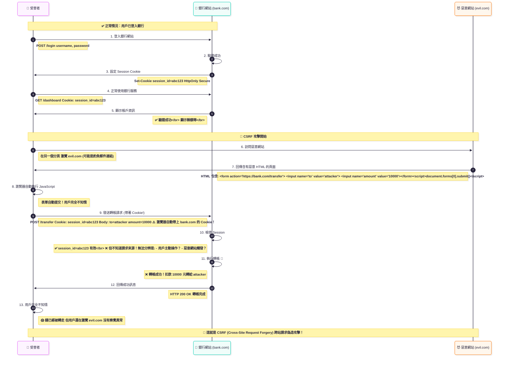

```mermaid
---
config:
  theme: redux-color
  look: neo
---
sequenceDiagram
    autonumber
    participant User as 👤 受害者
    participant Bank as 🏦 銀行網站 (bank.com)
    participant Evil as 😈 惡意網站 (evil.com)
    rect rgb(255, 255, 255)
    Note over User,Bank: ✅ 正常情況：用戶已登入銀行
    User->>Bank: 1. 登入銀行網站
    Note right of User: POST /login username, password
    Bank->>Bank: 2. 驗證成功
    Bank->>User: 3. 設定 Session Cookie
    Note left of Bank:Set-Cookie session_id=abc123 HttpOnly  Secure
    User->>Bank: 4. 正常使用銀行服務
    Note right of User: GET /dashboard Cookie: session_id=abc123
    Bank->>User: 5. 顯示帳戶資訊
    Note left of Bank: ✅ 驗證成功</br> 顯示餘額等</br>
    end
    rect rgb(255, 255, 255) 
    Note over User,Evil: 🚨 CSRF 攻擊開始
    User->>Evil: 6. 訪問惡意網站
    Note right of User: 在另一個分頁 瀏覽 evil.com (可能是釣魚郵件連結)
    Evil->>User: 7. 回傳含有惡意 HTML 的頁面
    Note left of Evil: HTML 包含: <form action='https://bank.com/transfer'> <input name='to' value='attacker'> <input name='amount' value='10000'></form><script>document.forms[0].submit()</script>
    User->>User: 8. 瀏覽器自動執行 JavaScript
    Note right of User: 表單自動提交！用戶完全不知情
    User->>Bank: 9. 發送轉帳請求 (帶著 Cookie!)
    Note right of User: POST /transfer Cookie: session_id=abc123 Body: to=attacker amount=10000 ⚠️ 瀏覽器自動帶上 bank.com 的 Cookie！
    Bank->>Bank: 10. 檢查 Session
    Note left of Bank: ✅ session_id=abc123 有效</br> ❌ 但不知道請求來源！無法分辨是: - 用戶主動操作？ - 惡意網站觸發？
    Bank->>Bank: 11. 執行轉帳 💸
    Note left of Bank: ❌ 轉帳成功！扣款 10000 元轉給 attacker
    Bank->>User: 12. 回傳成功訊息
    Note left of Bank: HTTP 200 OK 轉帳完成
    User->>User: 13. 用戶完全不知情
    Note right of User: 😱 錢已經被轉走 但用戶還在瀏覽 evil.com 沒有察覺異常
    end
    Note over User,Evil: 🎯 這就是 CSRF (Cross-Site Request Forgery) 跨站請求偽造攻擊！
```