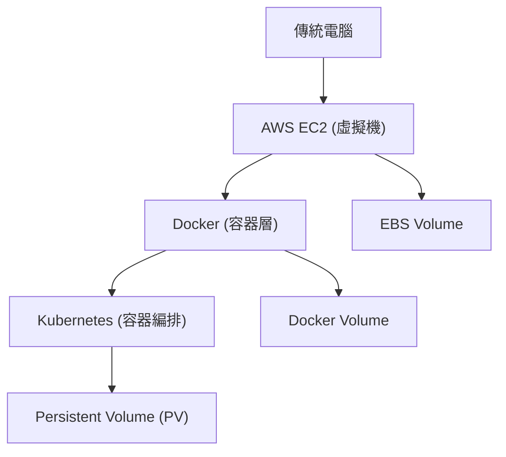

## 傳統電腦、AWS、Docker、Kubernetes 對照表
| 傳統電腦概念                          | AWS 對應                   | Docker 對應                              | Kubernetes 對應                      | 備註                          |
| ------------------------------- | ------------------------ | -------------------------------------- | ---------------------------------- | --------------------------- |
| **實體主機 (Physical Machine)** | **EC2 Instance**         | **Docker Host (運行 Docker Engine 的主機)** | **Node (工作節點 Worker Node)**        | 最底層的運算單位；一台實體或虛擬機承載整個環境     |
| **硬碟（SSD / HDD）**            | **EBS Volume**           | **Volume / Bind Mount**                | **PersistentVolume (PV)**          | 都是用來提供「儲存空間」給應用程式；差別在於抽象層不同 |
| **分割區（Partition）**           | Volume 內的 `/dev/xvda1` 等 | 容器內掛載點 `/data` 等                       | **PersistentVolumeClaim (PVC)**    | 向底層儲存請求資源的邏輯分割單位            |
| **RAID 陣列**                  | 多顆 EBS Volume 組成 RAID    | 多個 Volume 組合（ex: overlay）              | **StorageClass + PV Pool**         | 提供高 IOPS 或容錯的儲存架構           |
| **開機映像檔 / Ghost Image**      | **AMI**                  | **Container Image**                    | **Pod Template / Deployment YAML** | 都是「可重建執行環境」的模板              |
| **安裝應用程式**                   | 手動佈署在 EC2 上              | 用 Dockerfile 打包成 image                 | 用 Deployment / StatefulSet 自動佈署    | 自動化與可攜性差異巨大                 |
| **作業系統**                     | EC2 AMI (含 OS)           | 共用 Host OS Kernel                      | Node 的作業系統 (常見為 Linux)             | Docker 跑在 OS 上，K8s 管理多台 OS  |
| **網路設定 (IP, DNS)**           | ENI / VPC / Subnet       | Bridge Network / Host Network          | CNI (Container Network Interface)  | 不同層級的網路抽象與隔離方式              |
| **使用者權限 / 防火牆**              | IAM / SG / NACL          | Container User / Capabilities          | NetworkPolicy / RBAC               | 權限控管與網路安全對應                 |

## 虛擬化 vs 容器化
| 類型    | Virtual Machine (傳統 VM / EC2) | Container (Docker / K8s) |
| ----- | ----------------------------- | ------------------------ |
| 虛擬化層級 | 硬體層（Hypervisor 模擬整個 OS）       | OS 層（共用 Kernel）          |
| 啟動速度  | 慢（幾十秒~數分鐘）                    | 快（秒級）                    |
| 資源隔離  | 強（每台都有獨立 OS）                  | 弱（共用 Host Kernel）        |
| 使用場景  | 重型工作負載（DB、Legacy App）         | 微服務、短命週期工作               |
| 範例    | VMware、EC2、VirtualBox         | Docker、Kubernetes        |

👉 所以：

傳統電腦或 VM：偏向「虛擬硬體層級的模擬」

Docker：偏向「應用程式層級的封裝」

Kubernetes：偏向「整體叢集與生命週期管理」

