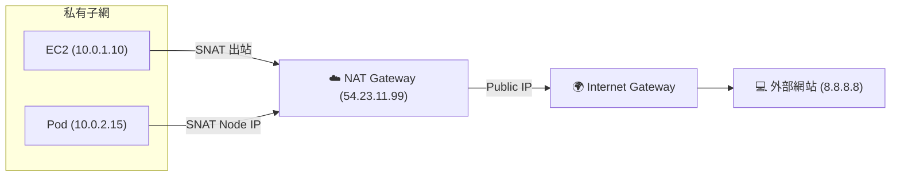
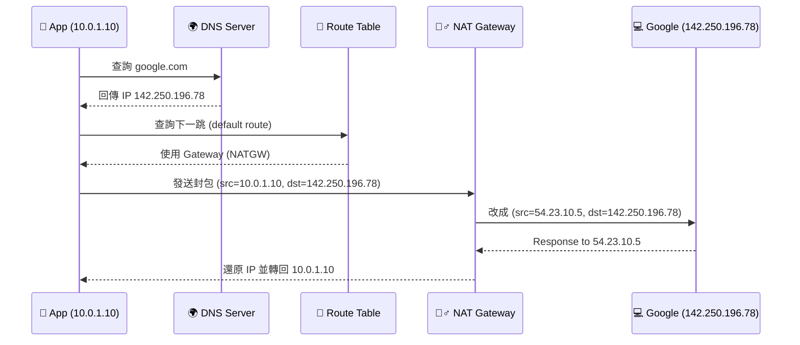
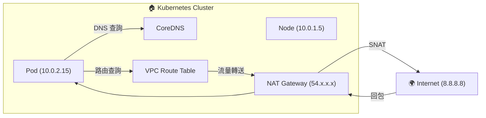
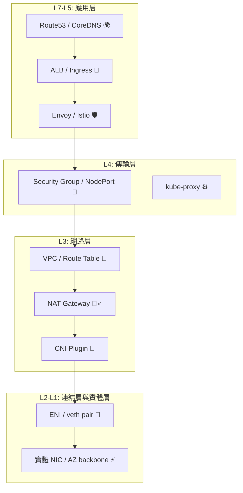
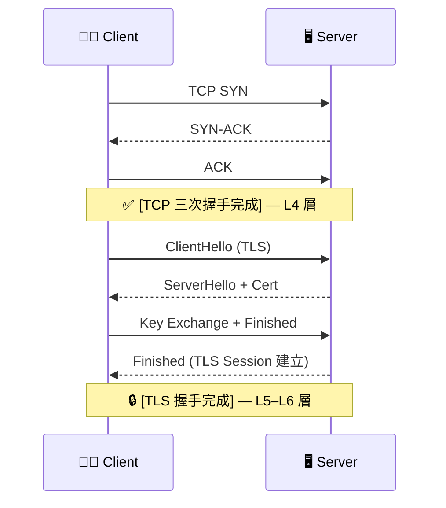
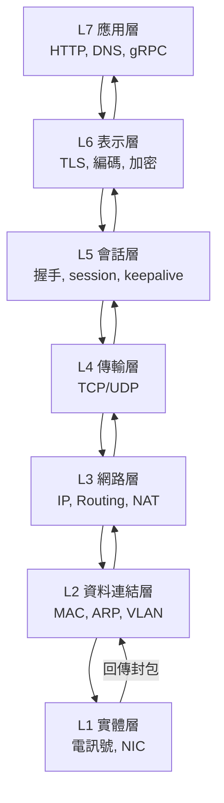
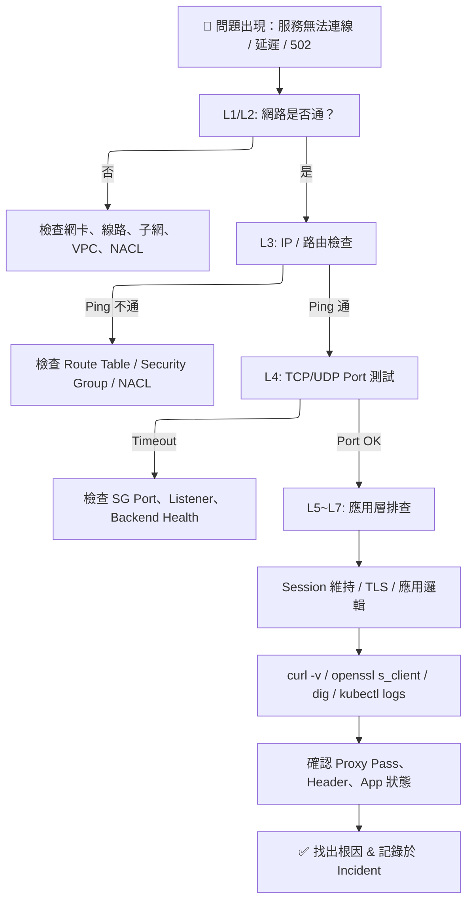

# 網路筆記

NAT（Network Address Translation，網路位址轉換）
其實是一種「封包變臉術」。

一句話講 NAT

NAT 就是讓一個封包的「來源 IP」或「目的 IP」變成別的樣子，
讓不同網路之間能安全、可控地溝通。

想像你在公司內部（10.0.0.5）打電話到外面的餐廳（8.8.8.8）訂餐。

但公司規定：

「內線員工不能直接打外線，要透過接線生（NAT Gateway）。」

所以：

你撥給接線生（NAT Gateway）

接線生幫你撥出去（來源號碼變成公司總機號碼 54.12.34.56）

餐廳看到的來電顯示是「54.12.34.56」，不知道你是內線哪個人

回電時，接線生再根據紀錄表把電話轉回你這邊

🎯 這就是 NAT：改 IP 但保持會話關聯。

NAT 的種類
| 類型                                 | 全名              | 封包改哪裡      | 用途             |
| ---------------------------------- | --------------- | ---------- | -------------- |
| **SNAT**                           | Source NAT      | 改來源 IP     | 封包出叢集或內網時      |
| **DNAT**                           | Destination NAT | 改目的 IP     | 把封包導向目標 Pod    |
| **Masquerade**                     | 一種特殊 SNAT       | 改成 Node IP | 常見於 kube-proxy |
| **PAT (Port Address Translation)** | 改 IP + Port     | 多人共享同一出口   |                |

---
AWS NAT
| 服務                         | 角色     | 功能                                        |
| -------------------------- | ------ | ----------------------------------------- |
| **NAT Gateway**            | 對外電話總機 | 私有子網的實例要出網（到 Internet），NAT Gateway 幫它改 IP |
| **Internet Gateway (IGW)** | 門口警衛   | 負責公開子網的進出（雙向）                             |
| **NAT Gateway**            | 只出不進   | 只允許「出站」，不允許外部直接打進來                        |

---
Kubernetes 內部也用 NAT！

例如：

kube-proxy 做 DNAT：ClusterIP → Pod IP

Pod 回傳時做 SNAT：Pod IP → Node IP

叢集出網時透過 NAT Gateway（AWS 層的 SNAT）

換句話說：

「在 K8S 裡看到的 NAT 是軟體級（iptables/ipvs）」
「在 AWS 裡看到的 NAT 是基礎設施級（NAT Gateway）」

兩者概念一樣，只是誰在幫你改 IP 不同而已。
---
總結對照表
| 層級               | NAT 類型    | 執行者          | 目的                  |
| ---------------- | --------- | ------------ | ------------------- |
| **AWS**          | SNAT      | NAT Gateway  | 私有子網出網              |
| **K8S Node**     | DNAT      | kube-proxy   | Service IP → Pod IP |
| **K8S Node**     | SNAT      | kube-proxy   | Pod → Node IP       |
| **Linux Kernel** | SNAT/DNAT | iptables     | 原始封包轉向              |
| **出口防火牆**        | SNAT      | Edge Gateway | 隱藏內部網段              |



總結一句話

NAT 其實是「幫封包換臉」的機制。
在 AWS 裡，它是 NAT Gateway。
在 K8S 裡，它是 kube-proxy + iptables。
目的都一樣：讓不同網路之間能安全、可追蹤地通訊。

角色分工比喻

| 類型              | 比喻角色        | 問題                        | 負責階段   |
| --------------- | ----------- | ------------------------- | ------ |
| **DNS**         | 🧏‍♀️ 接待員   | 「我要去哪裡？」（把名稱變成 IP）        | 封包發出前  |
| **Route Table** | 🧭 導航員      | 「走哪條路？」（決定下一站是哪個 Gateway） | 封包開始走時 |
| **NAT**         | 🕵️‍♂️ 偽裝特務 | 「我用誰的身份出去？」（改封包的 IP）      | 封包通行中  |

封包旅程故事版

想像你是封包，你準備從公司出發去 Google。

1️⃣ 你問 DNS：

「請問 google.com 在哪裡？」
DNS 回答：「它在 142.250.196.78。」

👉 DNS 負責把名字 → 變成 IP。

2️⃣ 你問 Route Table：

「那我該走哪條路？」
Route Table 回答：「外網都走公司出口（NAT Gateway）。」

👉 Route Table 負責決定出口。

3️⃣ 你到達 NAT Gateway：

「你好，我要出網！」
NAT Gateway 說：「好，但你要用我的身份（公網 IP）出去。」

👉 NAT 負責把封包「變臉」再送出去。

4️⃣ 外面的 Google 收到封包：

看到來源是公司 NAT 的 IP，不知道你是公司裡哪個人，
回應時再由 NAT 幫你轉回來。




| 類別              | 操作層級            | 對象       | 主要功能      | 常見位置                 |
| --------------- | --------------- | -------- | --------- | -------------------- |
| **DNS**         | 應用層（L7）         | 名稱 ↔ IP  | 解析 domain | Route53、CoreDNS      |
| **Route Table** | 網路層（L3）         | IP ↔ 下一跳 | 指定流量出口    | VPC、子網、Linux kernel  |
| **NAT**         | 傳輸層與網路層之間（L3.5） | IP ↔ IP  | 封包位址轉換    | NAT Gateway、iptables |

Kubernetes + AWS 實例對照

| 層級          | 服務                       | 功能                                                    |
| ----------- | ------------------------ | ----------------------------------------------------- |
| DNS         | CoreDNS / Route53        | Pod 找 Service IP（myservice.default.svc.cluster.local） |
| Route Table | VPC Route Table          | 決定封包走向（內網 or NAT）                                     |
| NAT         | kube-proxy / NAT Gateway | 封包改 IP（Pod → Node → 公網）                               |

---


---
## 「除了 DNS、Route Table、NAT，我還漏了誰？」
| 類別     | 名稱                                   | 角色比喻   | 功能摘要                           |
| ------ | ------------------------------------ | ------ | ------------------------------ |
| 🧭     | **Route Table**                      | 導航員    | 指引封包走向（哪個 Gateway）             |
| 🕵️‍♂️ | **NAT**                              | 偽裝特務   | 改封包來源/目的 IP                    |
| 🧏‍♀️  | **DNS**                              | 翻譯官    | 名字 ↔ IP 對照                     |
| 🧱     | **Firewall / Security Group / NACL** | 門衛     | 控制誰能進誰能出                       |
| 🚧     | **Load Balancer**                    | 門口的分流員 | 根據規則分配流量給多個後端                  |
| 🛠️    | **Proxy / Sidecar (Envoy, Istio)**   | 檢查哨    | 攔截、觀測、轉發應用層流量                  |
| 🧩     | **CNI Plugin**                       | 管線工程師  | 在 Kubernetes 裡建立 Pod ↔ Node 網路 |
| 🧰     | **VPC / Subnet**                     | 城市區劃員  | 劃分子網、CIDR、網段範圍                 |
| 🧊     | **Gateway (IGW, NATGW, TGW)**        | 城門關卡   | 控制出入口與跨區路徑                     |
| 📦     | **Service Discovery**                | 導覽地圖   | 誰在哪？（Consul / etcd / Service）  |

## 🧱 OSI 七層 vs AWS / Kubernetes 對照表
| OSI 層級       | 名稱           | 功能簡述                        | 對應 AWS 資源                                          | 對應 K8S 元件 / 技術                                                        |
| ------------ | ------------ | --------------------------- | -------------------------------------------------- | --------------------------------------------------------------------- |
| **L7 應用層**   | Application  | 使用者能看懂的協定 (HTTP, DNS, gRPC) | Route 53（DNS）<br>ALB（HTTP routing）<br>CloudFront   | CoreDNS<br>Ingress Controller<br>Envoy/Istio Sidecar<br>OpenTelemetry |
| **L6 表示層**   | Presentation | 「資料的格式轉換、編碼、加密／解密」                     | ACM / KMS (SSL/TLS)                                | Envoy mTLS、Istio Citadel                                              |
| **L5 會話層**   | Session      | 建立、維持、終止會話                  | WebSocket、API Gateway Session Mgmt                 | Istio Session / gRPC Connection / Sidecar                             |
| **L4 傳輸層**   | Transport    | 端口、連線、可靠傳輸 (TCP/UDP)        | NLB、Security Group (port control)                  | kube-proxy (iptables/IPVS)<br>Service (NodePort, ClusterIP)           |
| **L3 網路層**   | Network      | IP 位址、路由                    | VPC、Subnet、Route Table、NAT Gateway、Transit Gateway | CNI Plugin (Calico, Cilium, Flannel)<br>Pod CIDR Routing              |
| **L2 資料連結層** | Data Link    | 封包封裝與 MAC                   | ENI (Elastic Network Interface)、VLAN               | veth pair (Pod ↔ Node)<br>bridge0 / cni0                              |
| **L1 實體層**   | Physical     | 電纜、電信號                      | EC2 實體 NIC、AZ / Region 網路骨幹                        | Node 實體機的網卡 (eth0)                                                    |
## 視覺化

---
## 為什麼這麼想會「無敵」?
| 問題                    | 真正對應的 OSI 層 | 應該檢查的資源                     |
| --------------------- | ----------- | --------------------------- |
| DNS 無法解析              | L7          | Route53 / CoreDNS           |
| TCP 不通                | L4          | Security Group / kube-proxy |
| 不同 Node 間 ping 不通     | L3          | Route Table / CNI           |
| 外部出不去                 | L3          | NAT Gateway / IGW           |
| 內部連線延遲高               | L2/L3       | ENI / Pod overlay network   |
| HTTPS 憑證錯誤            | L6          | ACM / TLS 設定                |
| Request timeout（但網路通） | L7/L5       | Envoy / Application Logic   |
---
## 一張「OSI 七層 vs 雲端組件」懶人背誦表
| 層  | 英文名          | 關鍵字                | AWS 對應                   | K8S 對應                  |
| -- | ------------ | ------------------ | ------------------------ | ----------------------- |
| L7 | Application  | HTTP, DNS, gRPC    | Route53, ALB, CloudFront | Ingress, CoreDNS, Envoy |
| L6 | Presentation | SSL, JSON, Encode  | ACM, KMS                 | Istio mTLS              |
| L5 | Session      | Keepalive, Cookies | API Gateway              | Istio Session Mgmt      |
| L4 | Transport    | TCP/UDP, Port      | NLB, SG                  | Service, kube-proxy     |
| L3 | Network      | IP, Route          | VPC, NATGW, TGW          | CNI, PodCIDR            |
| L2 | Data Link    | Frame, VLAN        | ENI, Subnet              | veth pair, bridge0      |
| L1 | Physical     | 電信號, 纜線            | AZ Fiber, NIC            | Node eth0               |
---
## 費曼法總結：一句話記憶法

🧠 DNS 告訴你去哪裡（L7）
🧭 Route Table 告訴你怎麼去（L3）
🕵️‍♂️ NAT 幫你換身份（L3.5）
🚧 Security Group 決定能不能去（L4）
🧱 CNI 實際鋪路（L2/L3）
⚙️ kube-proxy 指揮交通（L4）
🌩️ VPC 是整座城市（L3）
🧩 Ingress 是城門（L7）
🧊 Pod 是住戶（L7/L4）


## Proxy 跟 ALB 有什麼不同？不是都能攔截 / 轉發流量嗎？

ALB 是「交通分流中心」
（AWS Layer 7 Load Balancer）
| 面向   | 說明                                  |
| ---- | ----------------------------------- |
| 所在層級 | L7（應用層），但偏「分流器」角色                   |
| 功能重點 | 根據 Host / Path / Header 決定流向        |
| 適用範圍 | 跨多台 EC2、ECS、EKS Node                |
| 可見度  | 對流量有基本觀測（Metrics / Logs）但不深入內容      |
| 範例   | `/api/* → ECS-A`、`/admin/* → ECS-B` |


ALB 像是一個智慧型交流道分流站，
你說「我要上北上路線」它幫你導向北上匝道，但不看你車裡載什麼。

Proxy（例如 Envoy、Nginx、HAProxy）是「全能攔截員」
| 面向   | 說明                                             |
| ---- | ---------------------------------------------- |
| 所在層級 | L7（應用層）甚至兼顧 L4                                 |
| 功能重點 | 攔截、修改、觀測、注入 Headers、mTLS、重試、熔斷                 |
| 適用範圍 | Pod 內 / Service Mesh 內部流量                      |
| 可見度  | 可看完整 Request / Response、統計延遲、傳遞 tracing header |
| 範例   | `Envoy`, `Nginx`, `Istio Sidecar`              |


Proxy 是哨站，每輛車經過時會檢查車牌、開箱、記錄時間、再放行。
有時它還會幫忙裝追蹤器（Tracing header），讓 Tempo / Jaeger 能重組整條路徑。

| 項目        | **ALB**               | **Proxy (Envoy/Nginx)**     |
| --------- | --------------------- | --------------------------- |
| 層級        | L7（偏分流）               | L7（偏應用處理）                   |
| 作用位置      | 雲端入口（EKS、EC2 外部）      | Pod 內 / Cluster 內部          |
| 功能重點      | 負載平衡、路由               | 攔截、重寫、監控、mTLS               |
| 瞭解流量深度    | Request 層級（Host/Path） | Header / Payload 細節         |
| 是否能做流量觀測  | 基礎 (CloudWatch)       | 高精度 (Tracing/Metrics/Logs)  |
| 是否支援 mTLS | ❌ 不行                  | ✅ 可（Sidecar）                |
| 是否可修改內容   | ❌ 不會動內容               | ✅ 可插入 header、改 body         |
| 範例        | AWS ALB / GCP LB      | Envoy / Nginx / Istio Proxy |


小結一句話：

- ALB 是 L7 的「交通分流主管」
- Proxy 是 L7 的「安全與監控哨站」

兩者都在應用層，但角度不同：
- ALB 專注在「外部進來時該去哪」

- Proxy 專注在「內部通訊時該怎麼看、怎麼控」

Firewall 跟 Security Group 算 L4 嗎？

對，大多情況下 Firewall / Security Group 屬於 L4。

但更精確地說，它跨 L3（IP）與 L4（Port）。
| 概念                      | 對應層   | 運作邏輯                       |
| ----------------------- | ----- | -------------------------- |
| **Firewall**            | L3–L4 | 根據 IP、Port、Protocol 過濾封包   |
| **Security Group (SG)** | L4    | 虛擬化的狀態型防火牆，允許 TCP/UDP Port |
| **NACL (Network ACL)**  | L3    | 對整個子網層級的 IP 過濾             |


延伸記法：

SG 是「雲端虛擬防火牆」，主要針對連線（Port + Protocol）。
傳統 Firewall 通常還會看封包內容（L7），但那時就屬於「下一代防火牆」（NGFW）。

Nginx 算 L7 還是 L4？

👉 Nginx 主要是 L7，但也能扮演 L4。

它的定位其實很彈性，看你開啟哪個模式：
| 模式                          | 層級                    | 功能重點                          |
| --------------------------- | --------------------- | ----------------------------- |
| **L7 (HTTP Reverse Proxy)** | 解析 HTTP / gRPC Header | 負載平衡、Rewrite、Header 改寫、SSL 終止 |
| **L4 (Stream Proxy)**       | 不解析內容，只轉 TCP/UDP      | 負載平衡、TCP 代理（ex: MySQL, Redis） |


例子：

- http {} 區塊 → L7 模式

- stream {} 區塊 → L4 模式

所以一句話：
- Nginx 是「可以上下切換的代理人」，預設在 L7，但能下探到 L4。

## 憑證簽發（CA / ACM / Cert Manager）算哪一層？
憑證簽發屬於 L6（表示層）。

原因：

憑證（Certificate）是為了加密與認證使用的

它參與了「資料表示」與「會話加密」兩層的行為

L6 負責編碼／加密，L5 負責會話建立（TLS handshake 用憑證）

📘 比喻：

CA (Certificate Authority) 是「給你車票的人」
L6 是「定義車票格式（可被 TLS 驗證）」
L5 是「實際用車票通過閘門（TLS 握手）」

🧩 所以：

- 憑證簽發（ACM、cert-manager）= L6

- 憑證驗證／交換（TLS handshake）= L5 + L6

- L3~L4 控流量（能不能通）

- L5~L6 保密通（怎麼通、安全不安全）

- L7 管資料（通的內容是什麼）

- Secret 是靜態加密，TLS 是動態加密

- Proxy 看 Request，ALB 分 Request

- FireLens 不看 Request，它看 Logs

## TLS handshake？三次握手？四次握手？🤔

- ❌ TLS 握手 ≠ TCP 三次握手。

- ✅ TLS 握手是<b>「建立安全連線」的流程</b>，發生在 TCP 三次握手之後。

- ✅ TCP 三次握手／四次揮手屬於 L4，TLS 握手屬於 L5–L6。



### 解析：

三次握手（SYN / SYN-ACK / ACK）：確保「可靠連線」建立（L4）

TLS 握手（ClientHello / ServerHello / Cert Exchange / Key Setup）：建立「加密層」（L5–L6）

### 簡單比喻：

TCP 是先確定電話接通；
TLS 是接通後兩人再「確認彼此身份 + 講暗號」的過程。

| 概念       | 層級    | 功能       |
| -------- | ----- | -------- |
| TCP 三次握手 | L4    | 建立可靠傳輸連線 |
| TLS 握手   | L5–L6 | 建立安全加密會話 |
| TCP 四次揮手 | L4    | 結束連線     |


## 🧱 那封包會不會真的「走過」七層？

理論上 OSI 是七層，但現實世界中，
封包不一定會經過所有七層，
甚至有些應用根本沒用到 L5、L6。

### 💡 為什麼？

因為「七層模型」是一個教學模型，不是每個封包都真的經過七層 API。
實際上在網路棧中，有些層會被合併或省略。

舉例:
| 協定 / 行為                            | 用到的層       | 為什麼                     |
| ---------------------------------- | ---------- | ----------------------- |
| **Ping (ICMP)**                    | L3         | 只測 IP 層，不走傳輸層（沒有 L4–L7） |
| **DNS (UDP)**                      | L4 + L7    | 應用層協定，但不需要會話（無 L5）      |
| **HTTP (TCP)**                     | L4 + L5–L7 | 有會話、有應用內容               |
| **HTTPS (TCP + TLS)**              | L4 + L5–L7 | 需握手、安全加密                |
| **Syslog / Fluent Bit TCP output** | L4 + L7    | 應用層傳輸資料但沒用 TLS          |
| **mTLS / gRPC Secure**             | L4 + L5–L7 | 同時有傳輸、加密、應用層結構化資料       |


所以：

- 沒有「七層都會走」的強制規定
- 有些協定直接「從 L7 跳到 L4」（例如 HTTP over TCP）
- 有些應用不需要 L5（沒有 session 管理）、也不需要 L6（沒加密）

延伸理解：

- L3~L4：封包送到哪裡
- L5~L6：封包怎麼通、是否安全
- L7：封包內容是什麼
- 所以只要「不需要安全會話」或「內容不加密」，L5/L6 就可能不存在。



## OSI 7 Layers Debug Runbook
| 層級     | 名稱                 | 觀察目標              | 常見問題                                 | 排查工具 / 指令                                                                       | 建議解法 / Debug 心法                                             |
| ------ | ------------------ | ----------------- | ------------------------------------ | ------------------------------------------------------------------------------- | ----------------------------------------------------------- |
| **L1** | 物理層 (Physical)     | 網線、硬體、電氣訊號        | 網線鬆脫、連線燈不亮、Link Down                 | `ethtool`, `dmesg`, `ip link`, `lspci`, 交換機介面監看                                 | - 檢查機房連線燈、線材插頭<br>- 雲端多為虛擬網路 → 通常跳過此層                       |
| **L2** | 資料鏈結層 (Data Link)  | MAC 對應、同網段通信      | ARP 錯誤、MAC 重複、VLAN 錯設                | `arp -a`, `ip neigh`, `tcpdump -e`, `brctl show`, Wireshark                     | - 檢查 VLAN 設定、子網掩碼<br>- 雲端時檢查 VPC Subnet 與 Security Group    |
| **L3** | 網路層 (Network)      | IP 路由 / 傳輸        | 無法 ping 通、錯誤路由、NAT 問題                | `ping`, `traceroute`, `mtr`, `ip route`, `curl -v`                              | - 檢查路由表、CIDR 範圍<br>- 雲端查 VPC Route Table、NACL               |
| **L4** | 傳輸層 (Transport)    | TCP/UDP 連線穩定性     | Connection refused / Timeout / Reset | `telnet`, `nc`, `ss`, `netstat`, `tcpdump port`, `iptables -L`                  | - 測試 port 是否開啟<br>- 雲端檢查 SG / NLB Listener<br>- 分析 TCP 三次握手 |
| **L5** | 會議層 (Session)      | Session 維持 / 狀態同步 | Session 掉線、WebSocket 中斷、登入後被登出       | `curl -I` 檢查 Cookie、`openssl s_client -connect`、Browser DevTools                | - 檢查 Session Stickiness<br>- ALB Session 維持設定、Cookie 名稱     |
| **L6** | 表示層 (Presentation) | 加解密、壓縮、格式轉換       | HTTPS 憑證錯誤、TLS version 不符、亂碼         | `openssl s_client -showcerts -connect`, `curl -vk`, `ssldump`, Browser DevTools | - 確認憑證鏈完整<br>- 確認 TLS policy、編碼一致性                          |
| **L7** | 應用層 (Application)  | 應用邏輯、協定解析         | HTTP 502/504、Header 缺失、DNS 解析慢       | `curl -v`, `dig`, `nslookup`, `tcpdump port 80`, `ngrep`, `kubectl logs`        | - 確認 Proxy pass、後端狀態<br>- 確認 DNS、Host Header、App Log        |

## Debug 流程 Runbook（由下而上排查）



| 問題現象            | 應該懷疑的層 | 使用工具                        | 指令範例                                 | 判斷重點              |
| --------------- | ------ | --------------------------- | ------------------------------------ | ----------------- |
| 無法 ping 通       | L3     | `ping`, `traceroute`        | `ping 8.8.8.8`                       | 網路封鎖或路由錯誤         |
| curl timeout    | L4     | `curl -v`, `nc`, `ss`       | `nc -vz example.com 443`             | Port 未開或 SG 拒絕    |
| HTTPS 憑證錯誤      | L6     | `openssl s_client -connect` | `openssl s_client -connect site:443` | 憑證過期、鏈不完整         |
| 502 Bad Gateway | L7     | `curl -v`, `kubectl logs`   | `curl -vk https://api.site`          | Proxy 無法連上後端      |
| DNS 錯誤或解析慢      | L7     | `dig`, `nslookup`           | `dig example.com`                    | DNS Cache、TTL 過期  |
| Session 常掉      | L5     | Browser DevTools, `curl -I` | 檢查 Cookie 攜帶                         | ALB stickiness 未開 |
| JSON 亂碼或空白頁     | L6     | `curl -i`, `less -r`        | Content-Type 不符                      | UTF-8 / gzip 壓縮問題 |


```
# Layer 3: 檢查 IP、路由、連線
ip addr show
ip route show
ping 8.8.8.8
traceroute example.com

# Layer 4: 檢查 TCP/UDP
ss -tulwn
nc -vz example.com 443

# Layer 5–6: 檢查 TLS/Session
openssl s_client -connect example.com:443
curl -vk https://example.com

# Layer 7: 檢查應用
dig example.com
kubectl logs -f deployment/myapp
curl -v -H "Host: example.com" http://127.0.0.1
```

## Token有問題為什麼是L5?而不是L6?
回顧
| 層級                    | 功能焦點                    | 關鍵詞             |
| --------------------- | ----------------------- | --------------- |
| **L5 Session 層**      | 維持「連線的狀態」與「Session 的識別」 | 誰在和誰溝通？這段對話屬於誰？ |
| **L6 Presentation 層** | 處理「資料格式的轉換、壓縮、加解密」      | 傳遞的資料要如何被解讀？    |

### Token 的本質：是「會話識別」而不是「資料編碼」

Token（不論是 JWT、OAuth Access Token、Session ID、Cookie）主要用來：

表示「使用者狀態」（誰登入了？）

建立「會話關聯」（這次請求屬於哪個 Session？）

控制「授權範圍與有效期」

👉 這些都是 L5 的「Session 管理」職責。
它回答的是：「這段通訊屬於誰？」這是典型的 L5 問題。

## 為什麼會讓人覺得跟 L6 有關？

因為 Token 通常：

被加密或簽名（HMAC / RSA）

透過 HTTPS 傳遞

包含 Base64 編碼內容

→ 所以表面看起來在做「加解密、編碼」，很像 L6 的範疇。

但注意：
- <b>加密的動作只是 保護 Token 傳輸或驗證真偽，而不是 Token 的「核心功能」。</b>
- 📘 L6 處理的是「資料如何被包裝」；
- 📗 L5 處理的是「誰擁有這段對話」。

實際流程對比
| 階段                      | OSI 層級 | 動作                | 負責項目        |
| ----------------------- | ------ | ----------------- | ----------- |
| Client login 發送帳密       | L7     | HTTP POST /login  | 應用層處理       |
| Server 簽發 JWT Token     | L5     | 建立 Session / 狀態標記 | Session 層職責 |
| Server 使用私鑰簽名 JWT       | L6     | 加密簽名、Base64       | 表示層職責       |
| Client 之後帶 Token 請求 API | L5     | 驗證會話 / Token 有效性  | Session 層職責 |
| HTTPS 傳輸過程加密            | L6     | TLS 加密封包          | 表示層職責       |

### 簡化記法（背口訣）
- L5 決定「這是誰的 Token」
- L6 負責「這個 Token 怎麼包起來傳」

## 實際應用中 L5 / L6 混合的案例
| 實務例子                   | 涉及層級    | 解釋                                      |
| ---------------------- | ------- | --------------------------------------- |
| HTTPS + Cookie Session | L5 + L6 | Cookie 是 Session ID（L5），HTTPS 是加密通道（L6） |
| OAuth 2.0 Access Token | L5      | 用於辨識授權狀態                                |
| JWT（含簽名與加密）            | L5 + L6 | Token 表示 Session 狀態（L5），簽名/編碼屬於 L6      |
| mTLS Mutual Auth       | L6 + L5 | 憑證驗證身分在 L6，但結果建立的「會話信任」在 L5             |

