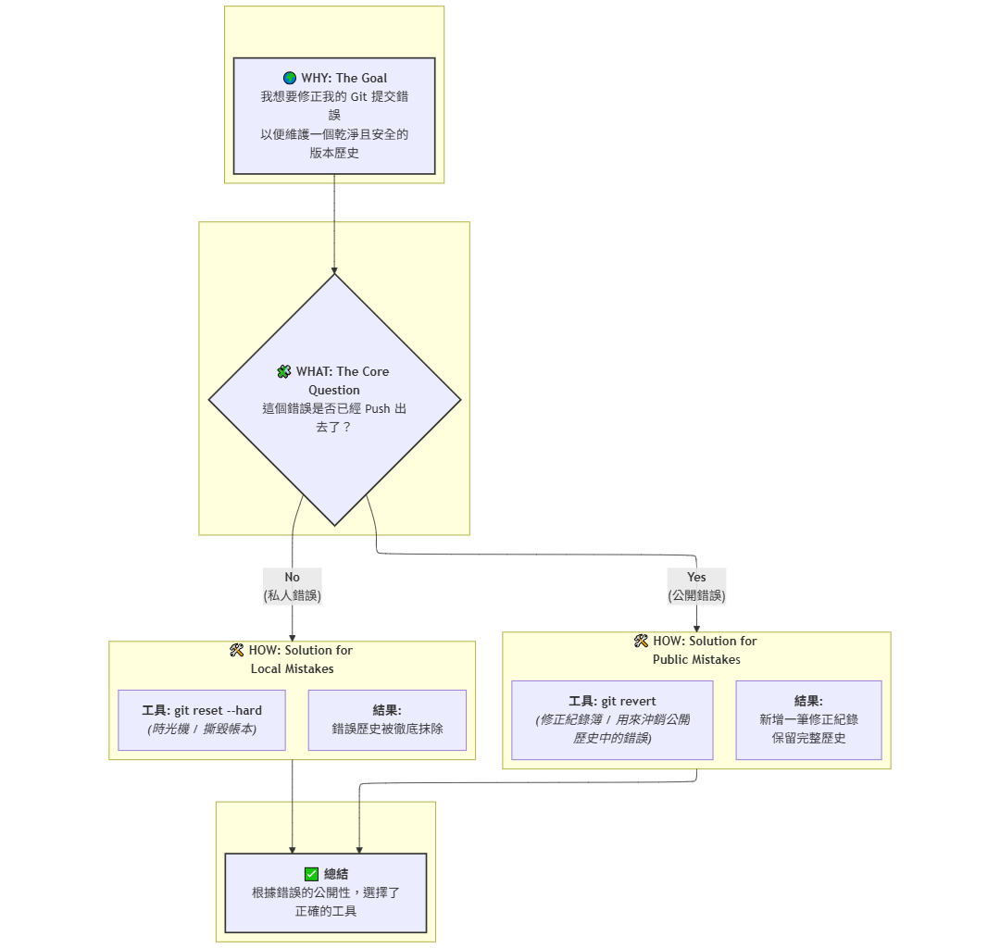

# Git 的黃金準則

首先，請記住這個黃金準則：**不要改寫公開歷史 (Do not rewrite public history)**。

- **私人歷史 (Private History)**：在你本機上，但你還沒有 push 到 GitHub 的 commit。
- **公開歷史 (Public History)**：你已經 push 到一個共享分支（例如 main）的 commit。

當你需要撤銷一個已經被推送到遠端的 commit 時，安全且專業的工具是 `git revert`。

---

## Git 錯誤修正的心智模型

這份筆記使用「Why-What-How」框架，並搭配 Mermaid User Story 圖表，來釐清開發中最常見的問題之一：當我不小心提交了錯誤的程式碼時，該如何安全地修正它？

---

## WHY - 核心故事

**身為** 一個開發者，  
**我想要** 修正我不小心提交的錯誤，  
**以便於** 維護一個乾淨且正確的程式碼歷史紀錄，並且不影響團隊協作。

---

## WHAT - 兩種場景與對應工具

在 Git 的世界裡，錯誤可以分為兩大類：

1. **私人錯誤 (Private Mistake)**: 錯誤的提交**還只存在**於我的本地電腦上，尚未推送到共享的遠端倉庫。
2. **公開錯誤 (Public Mistake)**: 錯誤的提交**已經被推送**到遠端的共享分支（例如 `main`），團隊成員可能已經看到了。

針對這兩種截然不同的場景，Git 提供了兩種核心工具來應對：

- `git reset --hard`: 一個強力的**「時光機」**，用來改寫和抹除**私人歷史**。
- `git revert`: 一個安全的**「修正紀錄簿」**，用來沖銷**公開歷史**中的錯誤。

---

## HOW - Mermaid User Story 視覺化流程



```
---
config:
  look: classic
  layout: elk
---
graph TD
    %% --- WHY ---
    subgraph " "
        Why["🌍 <b>WHY: The Goal</b><br>我想要修正我的 Git 提交錯誤<br>以便維護一個乾淨且安全的版本歷史"]
    end

    Why --> What

    %% --- WHAT ---
    subgraph " "
        What{🧩 <b>WHAT: The Core Question</b><br>這個錯誤是否已經 Push 出去了？}
    end

    What -- "<b>No</b><br>(私人錯誤)" --> ResetPath
    What -- "<b>Yes</b><br>(公開錯誤)" --> RevertPath

    %% --- HOW ---
    subgraph ResetPath [🛠️ <b>HOW: Solution for Local Mistakes</b>]
        Tool1["<b>工具: git reset --hard</b><br><i>(時光機 / 撕毀帳本)</i>"]
        Result1["<b>結果:</b><br>錯誤歷史被徹底抹除"]
    end

    subgraph RevertPath [🛠️ <b>HOW: Solution for Public Mistake</b>s]
        Tool2["<b>工具: git revert</b><br><i>(修正紀錄簿 / 用來沖銷公開歷史中的錯誤)</i>"]
        Result2["<b>結果:</b><br>新增一筆修正紀錄<br>保留完整歷史"]
    end

    ResetPath --> Goal
    RevertPath --> Goal

    %% --- CONCLUSION ---
    subgraph " "
     Goal["✅ <b>總結</b><br>根據錯誤的公開性，選擇了正確的工具"]
    end

    %% --- STYLING ---
    style Why fill,stroke:#333,stroke-width:2px
    style What fill,stroke:#333,stroke-width:2px
    style Goal fill,stroke:#333,stroke-width:2px
```


```
---
config:
  look: classic
  layout: elk
---
graph TD
    %% --- WHY ---
    subgraph " "
        Why2["<b>🌍 WHY: The Goal</b><br>我不小心在文件裡寫錯內容<br>需要安全地修正它"]
    end

    Why2 --> What2

    %% --- WHAT ---
    subgraph " "
        What2{🧩 <b>WHAT: The Core Question</b><br>我把文件連結分享出去了嗎？}
    end

    What2 -- "<b>No</b><br>(還沒分享，只有我知道)" --> ResetPath2
    What2 -- "<b>Yes</b><br>(已分享，同事可能在看了)" --> RevertPath2

    %% --- HOW ---
    subgraph ResetPath2 [🛠️ HOW: Solution for Private Mistakes]
        Tool12["<b>工具: 復原 (Undo / Ctrl+Z)</b><br><i>或「還原這個版本」</i>"]
        Result12["<b>結果:</b><br>錯誤段落消失<br>彷彿從未發生過"]
    end

    subgraph RevertPath2 [🛠️ HOW: Solution for Public Mistakes]
        Tool22["<b>工具: 新增「更正啟事」</b><br><i>在文件下方補充說明</i>"]
        Result22["<b>結果:</b><br>保留原始錯誤<br>新增修正紀錄，公開透明"]
    end

    ResetPath2 --> Goal2
    RevertPath2 --> Goal2

    %% --- CONCLUSION ---
    subgraph " "
     Goal2["✅ <b>總結</b><br>在不造成團隊混亂的情況下<br>成功修正了報告"]
    end

    %% --- STYLING ---
    style Why2 fill,stroke:#333,stroke-width:2px
    style What2 fill,stroke:#333,stroke-width:2px
    style Goal2 fill,stroke:#333,stroke-width:2px
```

---

## 筆記摘要

- 學習流程：WHY → WHAT → HOW
- 判斷錯誤是否已 push
- reset 追求乾淨，revert 追求安全透明
