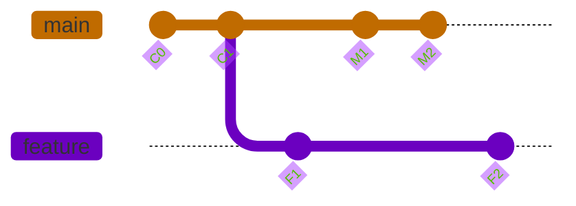
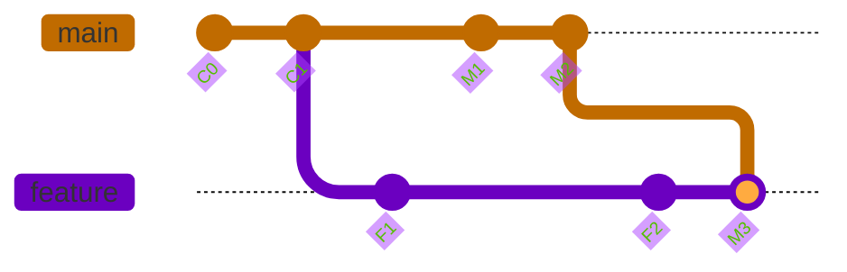
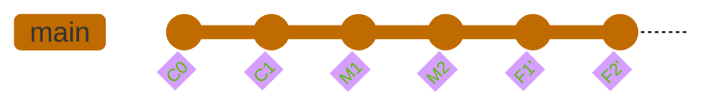

# Git Merge vs. Git Rebase: 概念與實戰詳解

> **TL;DR:** git merge 像將兩條河匯流，保留各自的歷史軌跡並產生一個新的匯流點；git rebase 則是像把其中一條河的源頭整個搬到另一條河的下游，讓歷史看起來像一條直線。

---

## 🌍 WHY - 核心故事/問題

在團隊協作中，一個常見的情境是：

1. 你從主分支 (main) 拉出一個新的功能分支 (feature) 開始開發
2. 在你開發的同時，你的同事完成了他的任務，並將他的程式碼合併回了 main 分支
3. 現在，main 分支已經比你當初拉分支時要更新了

這時，你就面臨一個問題：「如何將 main 分支上的最新變動，同步到我正在開發的 feature 分支上？」

git merge 和 git rebase 就是解決這個核心問題的兩種不同策略。它們的目標都是整合不同分支的變更，但它們達成目標的方式和最終產生的 Git 歷史紀錄截然不同。

---

## 🧩 WHAT - 核心概念拆解

- **git merge (合併)**: 非破壞性操作，將兩個分支的最新快照與共同祖先進行三方比較，產生一個全新的「合併提交」。完整保留歷史，但頻繁合併會產生雜亂的紀錄。

- **git rebase (變基)**: 改寫歷史操作，將你的分支上獨有的提交暫存，然後將分支起點移動到目標分支最新提交上，最後重新應用暫存的提交。創造乾淨線性歷史，但會改變 commit hash。

---

## 🛠️ HOW - Mermaid/實作步驟/程式碼範例

### 初始狀態

你在 C1 點開了一個 feature 分支，在你開發 F1, F2 的同時，main 分支也多了 M1, M2 兩個提交。



### 方法一：使用 git merge

```bash
# 1. 切換到你的 feature 分支
git checkout feature

# 2. 將 main 分支合併進來
git merge main
```

合併後的歷史：



### 方法二：使用 git rebase

```bash
# 1. 切換到你的 feature 分支
git checkout feature

# 2. 以 main 分支為新的基底，進行 rebase
git rebase main

# 如果遇到衝突，解決後繼續
git add .
git rebase --continue

# 如果想放棄，可以執行
git rebase --abort
```

變基後的歷史：



---

### 常見陷阱 (Pitfalls)

- **黃金法則**：永遠不要對一個已經被推送到遠端 (public/shared) 的分支進行 rebase！因為 rebase 會改寫歷史，會造成其他人的存儲庫大亂。

- **衝突解決複雜度不同**：merge 發生衝突時只需解決一次；rebase 可能需要解決多次，因為它逐一應用每個提交。

- **適用場景**：rebase 最適合用在尚未分享給他人的個人開發分支上，用來整理提交紀錄。

### 相關連結 (Links)

- [Atlassian - Merging vs. Rebasing](https://www.atlassian.com/git/tutorials/merging-vs-rebasing) - 超級經典的文章，必讀
- [Git rebase vs merge 視覺化對比](./git-operations.md) - 本工作區的 Git 操作筆記
