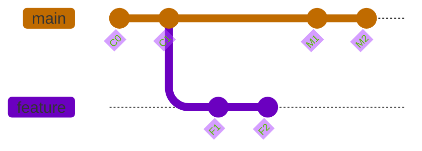

# Git 時光機：Merge 與 Rebase 的觀念與實戰詳解

> **一句話總結：** **Merge** 是在歷史上留下一個明確的「里程碑」，記錄著「嘿，我們在這裡匯合了！」；而 **Rebase** 則是搭乘時光機，回到過去，讓你的歷史看起來像是「我從一開始就是沿著這條路走的」。

---

### 🌍 **WHY - 核心故事：歷史學家的兩難**

想像你是一位歷史學家，正在撰寫一本關於某個主題的野史（你的 `feature` 分支）。你的主要參考資料是官方的正史（`main` 分支）。

1.  你根據當時的正史 C1 版本，開始撰寫你的野史章節 F1、F2。
2.  在你埋頭苦幹時，官方史書也出版了新的章節 M1、M2，補充了許多你不知道的背景故事。
3.  現在，你的野史 F2 章節，跟最新的正史 M2 版本有了出入。

你該如何更新你的著作，才能讓它既包含你的獨到見解，又符合最新的史實呢？這就是歷史學家的兩難，也是開發者的日常。

---

### 🧩 **WHAT - 核心概念拆解：兩種史書編纂法**

#### **1. `git merge` (合併)：忠實記錄的史學家**

> **作法：** 這位史學家選擇「加開一個章節」來說明。

他會在書的最後新增一個章節，標題是「關於 M2 版本正史的補充與整合分析」。這個章節（Merge Commit）會同時參考他自己的野史 F2 和最新的正史 M2，並把它們的內容整合在一起。

-   **優點：** 誠實、透明，完整保留了所有歷史軌跡。
-   **缺點：** 如果頻繁合併，書的目錄會變得非常雜亂。

#### **2. `git rebase` (變基)：搭時光機的完美主義作家**

> **作法：** 這位作家想讓自己的書看起來完美無瑕，彷彿他一開始就知道了所有事。

他搭上時光機，回到他動筆寫 F1 之前的時間點，先一口氣把最新的正史 M1、M2 讀完，接著，**在這個新知識的基礎上，重新下筆撰寫** 他的 F1 和 F2 章節（我們稱之為 F1' 和 F2'）。

-   **優點：** 乾淨、線性，書的歷史看起來就是一條直線。
-   **缺點：** 改寫了歷史，如果這本書已經出版（pushed），會讓讀者（同事）天下大亂。

> **`rebase` (變基) 的巧妙命名**
>
> `Rebase` 這個詞可以拆成 `Re-` (重新) 和 `Base` (基底)。分支的「基底」就是它從主線分岔出去的那個點。
>
> 所以 `rebase` 的字面意思就是「**重新定義你分支的基底**」。它精準地描述了這個過程：把你分支上獨有的 commit，從它們的「舊基底」上拔起來，然後接到一個你指定的「新基底」上。

---

### 🛠️ **HOW - 實戰操作與核心觀念**

#### **視覺化時間線**

- **初始狀態:** 野史 (`feature`) 和正史 (`main`) 分道揚鑣。
- **Merge 結果:** 出現一個新的匯流點 `M3`，誠實地記錄了整合過程。
- **Rebase 結果:** 野史 `F1'` 和 `F2'` 看起來像是在正史 `M2` 之後才寫的。



#### **📖 標準作業流程 (SOP)：如何安全地同步進度**

**情境：** 你人在你的野史 `F` 分支上，想要同步最新的正史 `M`。

1.  **第一步：下載最新的官方史書（但先不合併）**
    ```bash
    git fetch origin
    ```
    這個指令會把遠端 `origin` 的所有最新變動都下載到你本地，但完全不影響你手邊的工作。

2.  **第二步：啟動時光機，開始變基**
    ```bash
    # 直接以遠端最新的正史為基底，進行 rebase
    git rebase origin/main
    ```
    這個指令告訴 Git：「把我當前的 `F` 分支，搬到 `origin/main` 的頭上。」

3.  **第三步：處理時空悖論（如果發生衝突）**
    -   手動修改編輯器中的衝突檔案。
    -   `git add <檔案名>`
    -   `git rebase --continue`
    -   (如果搞砸了，隨時可以用 `git rebase --abort` 回到原點)

4.  **第四步：發布你完美的修訂版野史**
    ```bash
    git push --force-with-lease
    ```

#### **🔑 深入解析：SOP 背後的核心觀念**

##### **1. 遠端倉庫的暱稱：`origin` 與 `upstream`**

`origin` 是 Git 給遠端倉庫設定的**預設暱稱**，這是一個社群共識，但你完全可以取別的名字。

-   **設定暱稱：** `git remote add <暱稱> <URL>`
-   **建立追蹤：** 第一次 `push` 時使用 `git push -u <暱稱> <分支名>`，就能讓本地分支「記住」它對應的遠端分支。

在參與開源專案時，`origin` 通常指向你自己的 fork，而指向官方專案的 remote 則習慣被命名為 `upstream` (上游)。

##### **2. Push 的奧秘：為什麼 Rebase 後需要 `--force`？(續寫 vs. 改寫)**

這是一個關鍵問題，答案在於歷史的「連續性」。

-   **正常 `push` (續寫歷史):** 你本地的 commit 是在遠端歷史的基礎上**新增**的。Git 發現你的歷史是遠端的「續集」，可以安全地用「快轉 (Fast-forward)」模式合併。
    -   遠端: `A -> B -> C`
    -   本地: `A -> B -> C -> D -> E` (安全的線性延伸)

-   **`rebase` 後的 `push` (改寫歷史):** 你本地的歷史和遠端的歷史在某個點之後就**分岔**了，變成了「平行時空」。
    -   遠端: `A -> B -> C`
    -   本地 (rebase後): `A -> X -> Y -> Z` (歷史被完全改寫)
    -   Git 無法判斷哪個時空才是正確的，為了保護遠端歷史不被意外覆蓋，它會拒絕你的 `push`。你必須用 `--force` 或更安全的 `--force-with-lease` 來強制 Git 接受你的「新歷史」。

---

### 🚨 **Rebase 時光機操作手冊 (常見錯誤與解方)**

搭乘時光機是危險的，以下是常見的意外與逃生指南。

-   **情境一：「永無止盡的衝突地獄」**
    -   **解法：** `git rebase --abort` 放棄，先用 `git rebase -i HEAD~N` 將本地的數個 commit 合併成一個，從根本上減少衝突點，再重新 `rebase`。

-   **情境二：「時光機開到一半，我迷路了！」**
    -   **解法：** 不要猶豫，立刻中止！`git rebase --abort` 是你最好的朋友，它會取消一切，回到原點。

-   **情境三：「核彈級錯誤：我改寫了公共歷史！」**
    -   **解法：** 違反了「**絕不 rebase 已經分享出去的分支**」的黃金法則。立刻停止並通知同事，這是一個需要團隊溝通協調解決的問題，而不是技術問題。

-   **情境四：「糟糕，我在 Rebase 時把一個 commit 弄丟了！」**
    -   **解法：** 召喚 Git 的終極後悔藥 `reflog`！`git reflog` 會列出你所有的操作日誌，找到意外發生前的 commit hash，用 `git reset --hard <hash>` 就能回到過去。

---

### 🤔 **我該選 Merge 還是 Rebase？**

-   **想讓分支保持整潔，方便 Code Review？**
    -   在你的**個人開發分支**上，合併到 `main` 之前，先用 `rebase` `main` 來更新進度並整理自己的 commit。
-   **想保留完整、真實的開發軌跡？**
    -   當要把 `feature` 分支合併回 `main` 或 `develop` 這種**公共分支**時，使用 `merge`（通常是 `git merge --no-ff` 來強制產生一個 merge commit）。
-   **你正在和別人協作同一個 `feature` 分支？**
    -   **永遠使用 `merge`** 來同步團隊成員的進度。

---
### 關鍵觀念問答 (Q&A)
#### Q: origin 是什麼？一定要用這個名字嗎？
A: origin 只是 Git 給遠端倉庫取的預設暱稱，它是一個廣泛使用的共識 (Convention)，但不是一個強制規則。你完全可以取任何你喜歡的名字。

設定暱稱： 透過 git remote add <暱稱> <URL> 來設定。例如，git remote add my-server <URL>。

建立追蹤： 第一次 push 時使用 git push -u <暱稱> <分支名>，就能讓本地分支「記住」它對應的遠端分支。如果你用了自訂的暱稱，後續所有指令都要跟著改變，例如 git fetch my-server。

常見用法： 在開源協作中，origin 通常指向你自己的 fork，而指向官方專案的 remote 則習慣被命名為 upstream (上游)。

#### Q: 為什麼平常 push 不用 --force，但 rebase 之後就需要？
A: 這個問題的關鍵在於，你的本地歷史和遠端歷史的關係是「續寫」還是「改寫」。

正常 push (續寫歷史):
你的本地 commit 是在遠端歷史的基礎上新增的。Git 發現你的歷史是遠端的「續集」，可以安全地用「快轉 (Fast-forward)」模式合併，所以允許 push。

遠端: A -> B -> C

本地: A -> B -> C -> D -> E (安全的線性延伸)

rebase 後的 push (改寫歷史):
rebase 會銷毀舊的 commit，生成全新的 commit，導致你的本地歷史和遠端歷史在某個點之後就分岔了，變成了「平行時空」。

遠端: A -> B -> C

本地 (rebase後): A -> X -> Y -> Z (歷史被完全改寫)

Git 無法判斷哪個時空才是正確的，為了保護遠端歷史不被意外覆蓋，它會拒絕你的 push。你必須用 --force 或更安全的 --force-with-lease 來強制 Git 接受你的「新歷史」。

#### Q: rebase (變基) 這個名字有什麼特殊含義嗎？
A: 沒錯，這個名字取得非常巧妙！Rebase 可以拆成 Re- (重新) 和 Base (基底)。

Base (基底): 指的是你的分支是「從哪一個 commit 分岔出去的」。這個分岔點，就是你這個分支的「基底」。

Re- (重新): 代表「再一次」、「重新做一遍」。

所以，rebase 的字面意思就是「重新定義你分支的基底」。它精準地描述了這個過程：把你分支上獨有的 commit，從它們的「舊基底」上拔起來，然後接到一個你指定的「新基底」上。

---

### 常見陷阱 (Pitfalls)

- **黃金法則**：永遠不要對一個已經被推送到遠端 (public/shared) 的分支進行 rebase！因為 rebase 會改寫歷史，會造成其他人的存儲庫大亂。

- **衝突解決複雜度不同**：merge 發生衝突時只需解決一次；rebase 可能需要解決多次，因為它逐一應用每個提交。

- **適用場景**：rebase 最適合用在尚未分享給他人的個人開發分支上，用來整理提交紀錄。

### 相關連結 (Links)

- [Atlassian - Merging vs. Rebasing](https://www.atlassian.com/git/tutorials/merging-vs-rebasing) - 超級經典的文章，必讀
- [Git rebase vs merge 視覺化對比](./git-operations.md) - 本工作區的 Git 操作筆記
