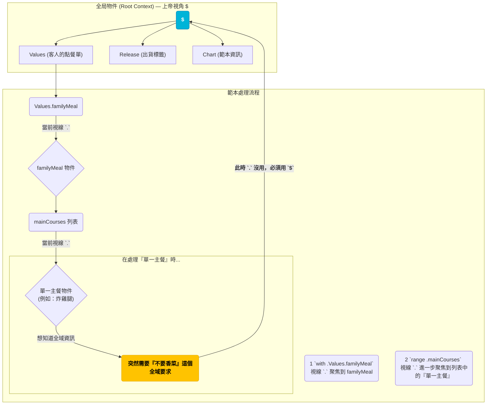

# Helm Templates 速懂筆記（新手友善版）

這是一份為初學者設計的 Helm 模板筆記，透過生活化的比喻，讓你快速掌握核心觀念。同時，它也保留了精簡的技術說明，方便有經驗者快速查閱。

## 📖 前言：一個點餐單的故事

想像一下，你開了一家便當店，為了提升效率，你設計了一張「萬用訂餐單範本」（這就是 **Helm Template**）。範本上有很多空格，像是：

* 主菜：_____
* 配菜：_____
* 飲料：_____（預設是紅茶）
* 特殊要求：_____

每當客人點餐，Helm 就會拿著客人的「客製化選項」（`values.yaml`），幫你把這張範本「填寫」成一份完整的訂單（Kubernetes YAML），然後送到廚房。

理解了這個故事，我們就能輕鬆看懂下面這些符號了。

---

## 🎯 `.Values` 從哪來？為什麼有時用 `.`、有時用 `$`？

Helm 在幫你「填寫」訂單範本時，會給你幾張不同的「資料小卡」讓你參考。

### `.Values` 是什麼？

> **類比：** `.Values` 就是那張寫滿了「客製化選項」的**客人點餐單**。

這是範本最主要的資料來源。它由 `values.yaml` 檔案、`-f other.yaml`、以及 `--set key=val` 等方式**合併**而成的參數集合。

* **`.Values`**：由 `values.yaml`、`-f other.yaml`、`--set key=val` **合併**而成的參數。
* **`.Release`**：此次安裝/升級的**出貨標籤**（`name`、`namespace`、`revision`…）。
* **`.Chart`**：訂單**範本本身的資訊**（`Name`、`Version`、`AppVersion`…）。
* **`.Files`**：一個**檔案管理員**，可以讀取 Chart 裡的其他檔案。

> **合併優先序（低→高）：** Chart 內建 `values.yaml` < 後續 `-f env-values.yaml`（後面的會覆蓋前面的） < `--set key=val` (擁有最高優先權)。

### `.` vs `$`：作用域的關鍵

> **類比：** `.` 是你「目前的視線焦點」，而 `$` 則是永不改變的「上帝視角」。

* `.` 代表**目前作用域**。你的「視線」會被 `with`、`range` 等指令**移動到更小的區塊**。
* `$` 永遠指向**最外層的根物件**（Global Context），不管你的視線在哪，用 `$` 就能看到全局。

### 視覺化理解：一張圖看懂 `.` 與 `$`

這張圖展示了當我們處理複雜訂單時，「視線 `.`」如何一步步往下移動，以及 `$` 如何讓我們隨時能看到全局。



### 實戰演練：一場 `.` 與 `$` 的情境劇

讓我們用一份「豪華全家餐」的訂單來實際操作一次。

**客人的點餐單 (`values.yaml`)**
```yaml
# 全域的特殊要求
specialRequest: "不要香菜"

# 豪華全家餐的設定
familyMeal:
  enabled: true
  mainCourses:
    - name: "炸雞腿"
      sauce: "胡椒鹽"
    - name: "烤鯖魚"
      sauce: "檸檬汁"
```

**訂單範本 (`template.yaml`)**
```gotemplate
# 範本開頭，你的視線 "." 還在整張訂單的最上層
# 所以用 .Values.specialRequest 沒問題
{{- if .Values.specialRequest }}
全域要求：{{ .Values.specialRequest }}
{{- end }}

# (1) with 指令：讓你的視線「聚焦」到 familyMeal 這個區塊
{{- with .Values.familyMeal }}

  # (2) 進入 with 區塊後，視線 "." 已經變成 familyMeal 了
  # 所以可以直接寫 .enabled，而不用寫 .Values.familyMeal.enabled
  是否訂購豪華餐：{{ .enabled }}

  # (3) range 指令：開始「一個一個」處理 mainCourses 裡的主餐
  {{- range .mainCourses }}

    # (4) 進入 range 後，視線 "." 又變得更細，變成「當前那一道主餐」
    # 例如，第一次是「炸雞腿」，第二次是「烤鯖魚」
    - 主菜：{{ .name }}，醬料：{{ .sauce }}

    # (5) **關鍵來了！**
    # 在處理單一主餐時，突然想知道「整張訂單的全域要求」是什麼？
    # 這時視線 "." 已經太窄了，必須用上帝視角 `$` 從最外層找回來！
    特殊備註：{{ $.Values.specialRequest }}

  {{- end }}
{{- end }}
```

**最終 Helm 填寫出的完整訂單：**
```yaml
全域要求：不要香菜
是否訂購豪華餐：true
- 主菜：炸雞腿，醬料：胡椒鹽
  特殊備註：不要香菜
- 主菜：烤鯖魚，醬料：檸檬汁
  特殊備註：不要香菜
```

### 新手實務守則

1.  **保持簡單**：在範本的最外層，直接用 `.Values` 就好。
2.  **進入區塊時，提高警覺**：當你看到 `with` 或 `range`，就代表你的視線 (`.`) 縮小了。
3.  **需要回頭看時，呼叫上帝**：在 `with` / `range` 區塊內，若要存取**外部**的資料，請毫不猶豫地使用 `$.Values`，保證萬無一失！

---

## 🧱 附錄：根物件（Root Context）的完整結構

實際上，Helm 傳遞給模板的是一個包含多個欄位的「大包裹」。你可以用下面這個概念模型來理解它的長相（偽 JSON 格式）：

```json
{
  "Values": {
    "specialRequest": "不要香菜",
    "familyMeal": {
      "enabled": true,
      "mainCourses": [
        { "name": "炸雞腿", "sauce": "胡椒鹽" },
        { "name": "烤鯖魚", "sauce": "檸檬汁" }
      ]
    }
  },
  "Release": {
    "Name": "my-family-meal-order",
    "Namespace": "dining-room",
    "Revision": 1,
    "IsInstall": true,
    "IsUpgrade": false
  },
  "Chart": {
    "Name": "bento-template",
    "Version": "1.0.0",
    "AppVersion": "v1"
  },
  "Files": {
    "//": "注意：這不是一般物件，而是一個檔案管理員（提供 Get/Glob 等函式）"
  }
}
```

> **`.Files` 的常見用法** > `.Files` 就像一個工具箱，讓你讀取 Chart 裡的其他檔案，例如設定檔或腳本。  
> `{{ (.Files.Get "config/my-config.txt") | indent 2 }}`  
> 建議搭配 `required` 避免檔案遺失而出錯：  
> `{{ required "config missing!" (.Files.Get "config/my-config.txt") }}`