# Kubernetes 筆記

「Kubernetes 是一個分散式的大腦，Master 負責決策，Node 負責行動。」
## K8S 的核心角色
| 層級                 | 組件                     | 功能比喻     | 核心任務                      |
| ------------------ | ---------------------- | -------- | ------------------------- |
| 控制層（Control Plane） | **API Server**         | 🧏‍♀️接待員 | 所有命令都要經過它（RESTful API入口）  |
| 控制層                | **etcd**               | 📦記憶體    | 儲存整個叢集狀態（key-value）       |
| 控制層                | **Controller Manager** | 🧩自動校正系統 | 發現「實際狀態 != 期望狀態」→自動調整     |
| 控制層                | **Scheduler**          | 🧮排班主管   | 決定 Pod 應該跑在哪個 Node        |
| 工作層（Node）          | **kubelet**            | 🦾現場工人   | 實際啟動 / 停止容器，回報健康狀態        |
| 工作層                | **kube-proxy**         | 🚦交通警察   | 管理 Pod 之間、Service 之間的網路流量 |

## 組件溝通流程
想像你：「kubectl apply -f myapp.yaml」

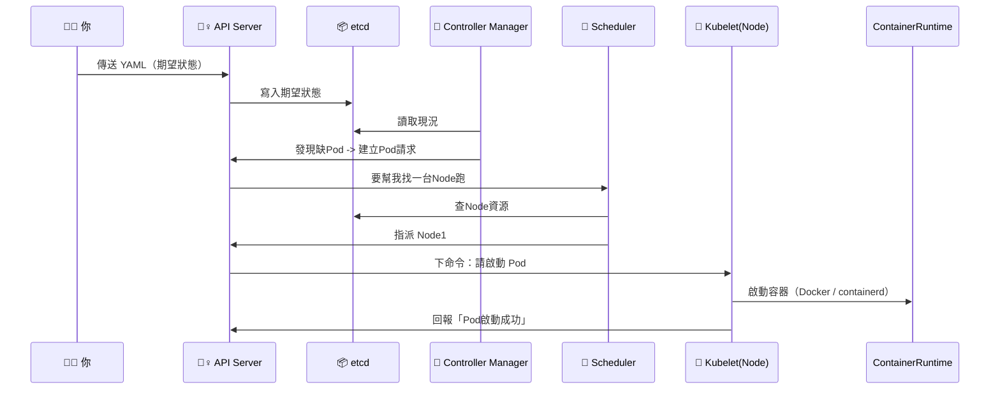

## 系統整體結構

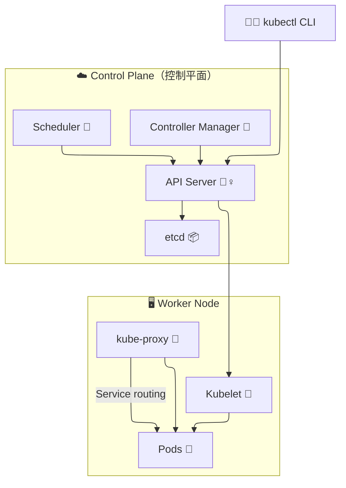

## 費曼學習法：用故事講一次

「K8S 就像是一家自動化的雲端工廠。」

你（工程師）→ 下指令給 接待員 API Server。

API Server → 把你的需求記進 etcd（資料庫）。

Controller Manager → 巡邏工廠，發現你說要 3 台機器但現場只有 2 台，就去催生一台。

Scheduler → 幫新機器安排在哪個生產線（Node）開工。

Kubelet → 實際在該生產線上啟動容器。

kube-proxy → 確保產品（服務）之間的流量順暢。

對應到實際場景
| 情境                     | 發生什麼事                   | 關鍵組件               |
| ---------------------- | ----------------------- | ------------------ |
| 你執行 `kubectl get pods` | API Server 回傳 etcd 中的狀態 | API Server + etcd  |
| Pod crash 掉            | Controller Manager 會重啟它 | Controller Manager |
| 新 Pod 被建立              | Scheduler 幫它選 Node      | Scheduler          |
| Node 上容器起不來            | Kubelet 負責重試並回報         | Kubelet            |
| Pod 間互相呼叫              | kube-proxy 建立轉送規則       | kube-proxy         |

## 總結
| 類別    | 組件                 | 你要記得一句話            |
| ----- | ------------------ | ------------------ |
| API 層 | API Server         | 所有命令都從這裡進出         |
| 狀態儲存  | etcd               | Kubernetes 的「真相來源」 |
| 控制邏輯  | Controller Manager | 自動修復實際狀態           |
| 排班系統  | Scheduler          | 幫 Pod 找家           |
| 工作執行  | Kubelet            | 幫忙開工               |
| 網路管理  | kube-proxy         | 幫流量找路              |

---
## K8S 網路精華
一句話總結：
Kubernetes 的網路就像一個多層水管系統，
Pod 之間、Service、NodePort、Ingress 就是不同層級的水閘門。

## 整體層級圖
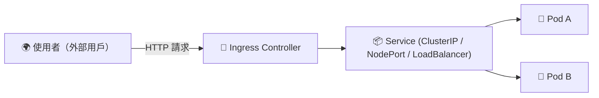

## 四層水管法則（費曼講故事版）

想像一個外部訪客要喝「Pod 的果汁」，他必須經過四道水閘門
| 層級 | 名稱                          | 比喻       | 實際行為                              | 常見應用                 |
| -- | --------------------------- | -------- | --------------------------------- | -------------------- |
| L1 | **Pod 網路**                  | 🧃工廠內管線  | 每個 Pod 都有 IP，Pod↔Pod 可直連          | Cluster overlay（CNI） |
| L2 | **Service (ClusterIP)**     | 🚰 廠內總水管 | 提供穩定虛擬 IP，後面連多個 Pod               | 負載平衡內部流量             |
| L3 | **NodePort / LoadBalancer** | 🏭 廠外出水口 | 將內部 Service 映射到每台 Node            | 外部訪問入口               |
| L4 | **Ingress**                 | 🏙️ 城市大門 | 解析 HTTP Host / Path，導流至不同 Service | 提供反向代理 / HTTPS       |

## 核心資料流
以使用者透過 Ingress 訪問 Pod 為例：

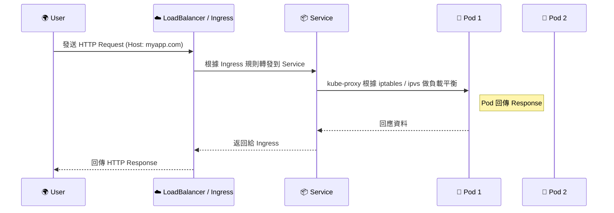

## 每層的「真實技術角色」
| 組件                                    | 實際作用                                 | 備註                             |
| ------------------------------------- | ------------------------------------ | ------------------------------ |
| **CNI (Container Network Interface)** | 建立 Pod 的虛擬網路卡（veth pair）與子網 IP       | 常見：Calico / Cilium / Flannel   |
| **kube-proxy**                        | 在 Node 上配置 iptables / ipvs 規則        | 實現 Service 的負載平衡               |
| **Service**                           | 建立穩定的虛擬 IP（ClusterIP）                | 由 kube-proxy 實現                |
| **Ingress Controller**                | 通常是 Nginx / Traefik / ALB Controller | 解析域名、TLS、Path routing          |
| **External Load Balancer**            | AWS ELB / GCP LB                     | 曝露 NodePort / Ingress Endpoint |


## 費曼故事再講一次（你能教別人）

Kubernetes 網路就像一個「多層水管系統」：

每個 Pod 就是一個「飲料機」，都有自己的 IP。

但飲料機會壞，所以你不直接接它，而是接到「總水閘 Service」。

這個 Service 會自動幫你切換不同的飲料機（Pod）。

如果你要讓外面的客人也喝到，
你就要在門口開個「NodePort」或裝個「Ingress」。

Ingress 是智慧型閘門：看到網址 /juice 給果汁，/coffee 給咖啡 ☕。

## 實戰應用場景
| 使用情境                      | 流程                                       | 圖示 |
| ------------------------- | ---------------------------------------- | -- |
| 外部用戶訪問網站 `myapp.com`      | `User → Ingress → Service → Pod`         | 🌐 |
| 同 Namespace 中 Pod 呼叫另一個服務 | `Pod A → ServiceB.cluster.local → Pod B` | 🔁 |
| NodePort 測試外部存取           | `curl http://<NodeIP>:<NodePort>`        | 🧪 |
| 內網 Service 之間負載均衡         | kube-proxy 管理 iptables / ipvs            | ⚙️ |

## 總結
| 層級 | 名稱                      | 功能                  | 備註             |
| -- | ----------------------- | ------------------- | -------------- |
| L1 | Pod                     | 最小網路單位              | 每個 Pod 一個 IP   |
| L2 | Service                 | 穩定虛擬 IP / 負載平衡      | ClusterIP      |
| L3 | NodePort / LoadBalancer | 暴露內部服務給外界           | 節點層或雲層         |
| L4 | Ingress                 | HTTP / HTTPS 反向代理入口 | Path / Host 路由 |


## 分層金字塔
K8S 的網路封包流向是一場「多層轉送接力賽」
User → Ingress Controller → NodePort / Service → kube-proxy → Pod → Container

分層金字塔
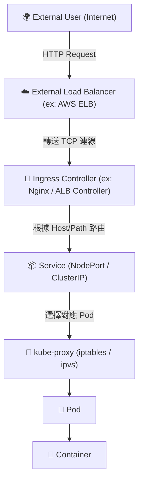

## 費曼學習法：故事講一遍

### 想像你是個「請求封包」，你的旅程如下 👇：

🚶‍♂️ Step 1：你從外部世界出發（User → LoadBalancer）

你是一個 curl https://myapp.com 的封包。

AWS 外部 Load Balancer（或 Cloud Provider LB）接收到你。

它根據 DNS 解析，知道要轉送給某個 Kubernetes Node 上的 Ingress Controller Pod。

🧩 關鍵詞：

##### AWS ELB / NLB / GCP LB / Azure LB
##### DNS A record → External LB IP
---
🚪 Step 2：Ingress Controller（反向代理邏輯）

你抵達 Ingress Controller（例如 Nginx Ingress Pod）。

Ingress Controller 讀取 Ingress YAML 規則，例如：

```
rules:
  - host: myapp.com
    http:
      paths:
        - path: /api
          backend:
            service: myapp-service
```
根據 Host + Path 決定要打哪個 Service

🧩 關鍵詞：

##### Ingress Controller 是一個 普通 Pod
##### 它透過 ServiceAccount + RBAC 讀取 Ingress 資訊
##### 其實本質是一個反向代理 (Nginx / Envoy)

---
📦 Step 3：Ingress → Service (NodePort / ClusterIP)

Ingress Controller 轉送請求給對應的 Service（ClusterIP 或 NodePort）

如果 Service 是 ClusterIP，封包會送進叢集虛擬網路（Cluster internal）

如果是 NodePort，它會在每個 Node 的某個 port 監聽（例如 30080）

🧩 關鍵詞：

##### ClusterIP 是虛擬 IP，不存在實體介面
##### NodePort 是 Node 的真實 port（外界可連）
##### LoadBalancer Service 其實是 NodePort + Cloud LB 的封裝
---
🦾 Step 4：Service → kube-proxy → Pod

kube-proxy 會在每個 Node 維護 iptables 或 IPVS 規則表

當封包到達 Service IP 時：

iptables / IPVS 負責決定要送到哪個 Pod（負載平衡）

通常會隨機挑一個後端 Pod IP（Endpoints）

🧩 關鍵詞：

##### kube-proxy = Service 負載平衡控制器
##### 後端 Pod 資訊存於：Endpoints（或 EndpointSlice）

---
🧫 Step 5：Pod → Container（CNI 網路層）

kube-proxy 把封包導向目標 Pod IP。

Pod 內部有一個虛擬網卡（veth pair），由 CNI Plugin 建立。

CNI（如 Calico / Cilium / Flannel）會：

分配 IP & 處理跨 Node Pod 通訊（Overlay / BGP / VXLAN）

🧩 關鍵詞：

##### eth0 in Pod ←→ veth pair ←→ Node namespace
##### Overlay network = 封包封裝 + 虛擬傳輸

---
## 整體封包路徑

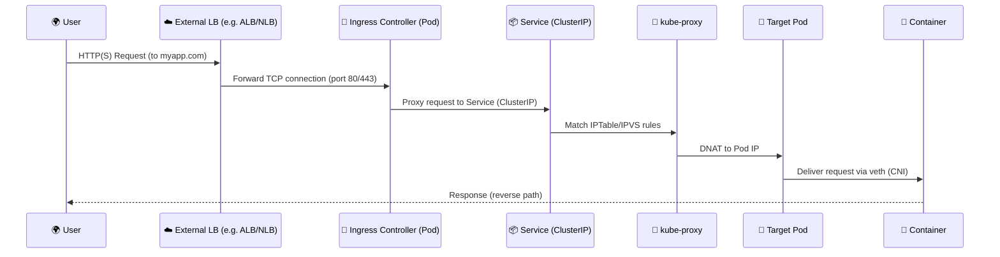

## Troubleshooting 心法
| 症狀                       | 可能原因                          | 用什麼工具查                                         |             |
| ------------------------ | ----------------------------- | ---------------------------------------------- | ----------- |
| `curl <service>` timeout | kube-proxy 沒設規則 / Pod 不 Ready | `kubectl get ep`                               |             |
| Pod 間無法互通                | CNI 問題 / Overlay 卡住           | `kubectl exec -it pod -- ping <target-ip>`     |             |
| 外部無法連進                   | Ingress / NodePort 沒綁定        | `kubectl describe ingress` / `kubectl get svc` |             |
| 某 Node 不通                | kube-proxy 失效 / iptables 錯亂   | `iptables-save`                                | `grep <svc>` |
| Ingress 502              | 反向代理找不到 Service               | 看 Ingress Controller log                       |             |
| NodePort 可通但域名不行         | DNS 設定 / External LB 設定錯      | `dig myapp.com` / `nslookup`                   |             |

## LoadBalancer 型 (外部使用者 → ALB → Pod)

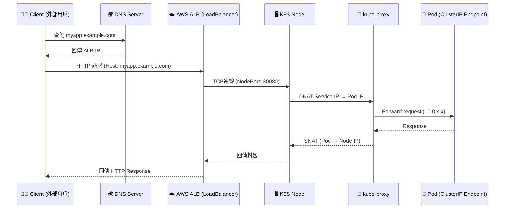

關鍵機制
- ALB 的 Target Group 綁定 NodePort（每個 Node 上開同一 Port）
- kube-proxy 在 Node 上做 DNAT，把流量轉給對應的 Pod
- 出站封包經 SNAT 回 ALB

## NodePort 型 (外部用戶 → Node IP → Pod)


關鍵機制

- NodePort 開在每台 Node 的相同 port（例如 30080）
- kube-proxy 維護 DNAT 規則，把 NodePort 流量導到內部 Pod
- 外部直接透過 NodeIP 進入叢集

## ClusterIP 型 (叢集內 Pod → Pod)

適用場景：內部 Service 通訊，例如 curl myservice.default.svc.cluster.local

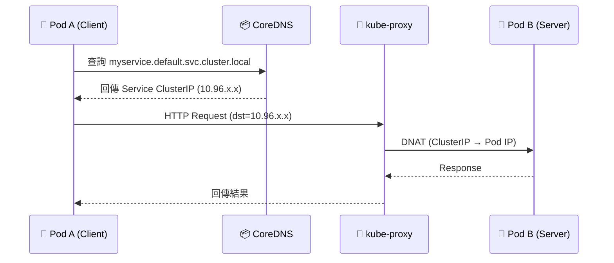

關鍵機制
- ClusterIP 是虛擬 IP，不存在實體網卡
- kube-proxy 在每台 Node 維護 Service IP 映射表
- 封包直接 DNAT 至 Pod 真實 IP

## 補充：對照 TCP 層邏輯
| 層級   | LoadBalancer  | NodePort       | ClusterIP     |
| ---- | ------------- | -------------- | ------------- |
| DNS  | 公網域名 → ALB IP | 公網域名 → Node IP | Cluster DNS   |
| TCP  | Client→ALB    | Client→Node    | Pod→Pod       |
| NAT  | ALB→NodePort  | NodePort→Pod   | ClusterIP→Pod |
| SNAT | Node→ALB      | Node→Client    | Node→PodA     |
| 流向   | 雙向透過 NAT      | 雙向透過 NAT       | 內部直連          |
---
## 什麼是 myservice.default.svc.cluster.local？
| 區段          | 意思                   | 類比       | 說明                                     |
| ----------- | -------------------- | -------- | -------------------------------------- |
| `.local`    | 本地網域（Cluster domain） | 公司總部     | Kubernetes 預設所有內部服務都屬於 `cluster.local` |
| `.svc`      | Service 層級           | 部門樓層     | 表示這是一個「Service」的 DNS                   |
| `.default`  | Namespace 名稱         | 哪一個部門    | Service 屬於哪個命名空間（預設是 default）          |
| `myservice` | Service 名稱           | 部門裡的某位員工 | 你建立的 Service 的名字                       |

比喻講法：

這就像你在公司內部寄信給「王小明@工程部.公司內網」，
其中：

王小明 = myservice

工程部 = default (Namespace)

公司內網 = svc.cluster.local

## Kubernetes 為什麼要這樣命名？

K8S 是「內部有自己 DNS 的小宇宙」，每個 Service 建立時會自動註冊成 DNS 記錄。
CoreDNS（以前是 kube-dns）會自動生成像這樣的對應：
``` myservice.default.svc.cluster.local → 10.96.0.42 ```

也就是說：
你在 Pod 裡面 curl myservice，其實 CoreDNS 幫你解析到 10.96.0.42（Service ClusterIP）。
這樣一來你不用知道 Pod IP，只要記得 Service 名稱。

## 實際 DNS 查詢流程

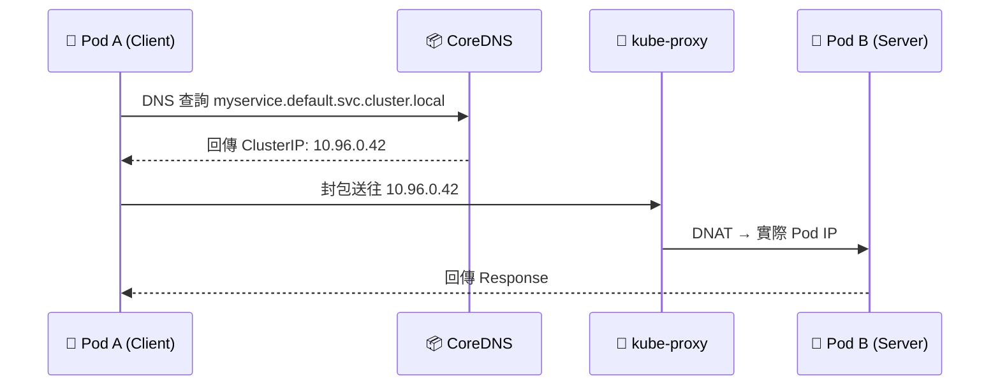

想自己驗證？

你可以在任何 Pod 內執行：
```nslookup myservice.default.svc.cluster.local``` 或 ```dig myservice.default.svc.cluster.local```

預期得到
```
Name:   myservice.default.svc.cluster.local
Address: 10.96.0.42
```

## Kubernetes 內部 DNS 與 Service 封包流向圖

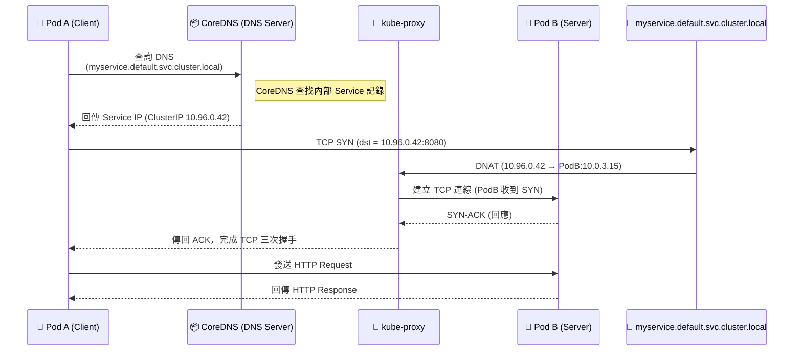
### 解說分層（從 DNS 到封包）
| 層級            | 行為                                            | 實際角色                            |
| ------------- | --------------------------------------------- | ------------------------------- |
| **DNS 層**     | PodA 查詢 `myservice.default.svc.cluster.local` | CoreDNS 回傳該 Service 的 ClusterIP |
| **Service 層** | Service ClusterIP 是虛擬 IP，不存在實體介面              | kube-proxy 維護對應表                |
| **Network 層** | kube-proxy DNAT 轉送流量到真實 Pod IP                | iptables/IPVS 實現                |
| **應用層 (L7)**  | Pod A 與 Pod B 經 TCP 建立連線並交換資料                 | HTTP Request/Response           |

### DNS 名稱分解對照表
| 區段              | 意思              | 功能                     |
| --------------- | --------------- | ---------------------- |
| `myservice`     | Service 名稱      | Kubernetes 物件名稱        |
| `default`       | Namespace       | 決定在哪個命名空間搜尋            |
| `svc`           | 表示這是 Service 類型 | CoreDNS 會依 svc zone 處理 |
| `cluster.local` | Cluster 預設網域    | 所有內部服務的根域名             |

### kube-proxy 在這過程中做什麼？
| 動作           | 說明                        |
| ------------ | ------------------------- |
| 建立 NAT 規則    | 將 Service IP 對應到 Pod IP   |
| 維護 Endpoints | 監控哪些 Pod 是健康的可接收流量        |
| 平衡流量         | 多個 Pod 時做輪詢 (Round Robin) |
| 回程封包 SNAT    | 封包離開時將 Pod IP 改成 Node IP  |

### 費曼法講法
Pod 裡的程式其實看不到 Pod IP，它只知道「我要打 myservice」。

CoreDNS 告訴它：「這個服務對應的虛擬 IP 是 10.96.0.42。」

然後 kube-proxy 說：「我幫你把 10.96.0.42 的封包轉給目前健康的 Pod，
例如 10.0.3.15。」

所以雖然看起來你在打一個虛擬 IP，但實際是 kube-proxy 幫你完成的轉送。
這就是 Kubernetes 的「Service abstraction」魔法。


### Debug 時可用指令
| 目的                 | 指令                                              |                  |
| ------------------ | ----------------------------------------------- | ---------------- |
| 查 Service IP       | `kubectl get svc myservice -o wide`             |                  |
| 查 Endpoints        | `kubectl get endpoints myservice`               |                  |
| 測試解析               | `kubectl exec -it <pod> -- nslookup myservice`  |                  |
| 看 kube-proxy 是否有規則 | `iptables -t nat -L -n                          | grep 10.96.0.42` |
| 驗證連線               | `curl myservice.default.svc.cluster.local:8080` |                  |


## 總結
| 層級  | 組件                               | 封包角色          | 技術核心                  |
| --- | -------------------------------- | ------------- | --------------------- |
| 1️⃣ | **External LB**                  | 進入叢集的第一關      | DNS、TCP轉送             |
| 2️⃣ | **Ingress Controller**           | 反向代理 + HTTP路由 | Nginx、ALB、Traefik     |
| 3️⃣ | **Service (NodePort/ClusterIP)** | 穩定虛擬入口        | kube-proxy、Endpoints  |
| 4️⃣ | **kube-proxy**                   | 控制轉送規則        | iptables / IPVS       |
| 5️⃣ | **CNI (Calico/Cilium)**          | Pod 網路層       | veth pair、Overlay/BGP |
| 6️⃣ | **Pod**                          | 真正服務容器        | containerd、eth0       |

---

## Kubernetes 網路的反向封包流向
Kubernetes 的「回程封包」靠 SNAT / DNAT 保證請求能從正確的 Node 回到正確的 Pod，
再回傳給正確的 Client。

回顧正向路徑
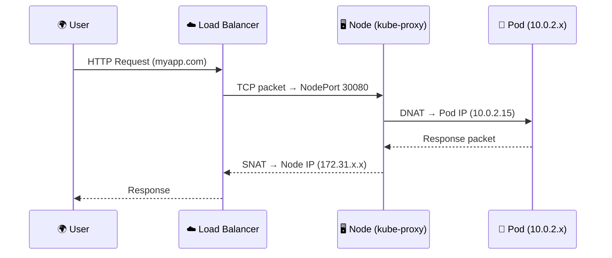

## 費曼故事版

想像你是個「回程封包」：

1️⃣ 你從 Pod 出發：

「嗨，我是回應封包，要回給剛剛那個用戶！」

2️⃣ 你經過 Node 上的 kube-proxy：

它會幫你加上 SNAT（Source NAT），把來源 IP 改成 Node 的 IP。
因為外面的世界只知道 Node IP，不知道 Pod IP。

3️⃣ 你抵達 Load Balancer：

Load Balancer 收到 Node 的回覆，會轉給原本的使用者。

4️⃣ 使用者收到資料包時，看起來來源是「Load Balancer」，而不是 Pod。

但沒關係，對 TCP 來說這是對稱的 session。

## 反向封包流向
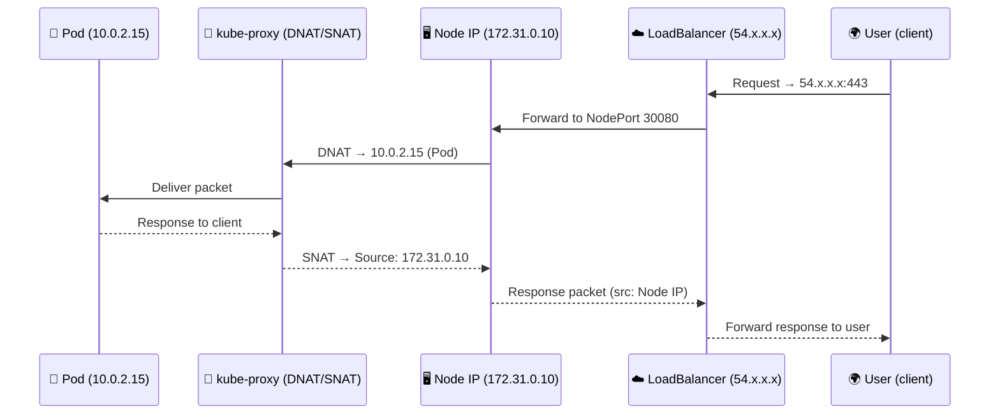

## 關鍵機制拆解
| 名稱                  | 全名                        | 作用                    | 發生位置        |
| ------------------- | ------------------------- | --------------------- | ----------- |
| **DNAT**            | Destination NAT           | 將 Service IP → Pod IP | 封包進入叢集時     |
| **SNAT**            | Source NAT                | 將 Pod IP → Node IP    | 封包離開叢集時     |
| **iptables / IPVS** | Linux Routing Table       | 管理 DNAT/SNAT 規則       | Node 端      |
| **conntrack**       | Connection Tracking Table | 記錄 NAT 對應關係           | Node kernel |


## 真實封包範例
```
Client IP:     1.2.3.4
LB IP:         54.210.10.5
Node IP:       172.31.0.10
Pod IP:        10.0.2.15
Service IP:    10.96.0.42
```

封包變化如下：
| 階段      | 來源 IP       | 目的 IP             | 說明                      |
| ------- | ----------- | ----------------- | ----------------------- |
| 使用者發出   | 1.2.3.4     | 54.210.10.5       | User → LoadBalancer     |
| LB 轉送   | 1.2.3.4     | 172.31.0.10:30080 | LoadBalancer → NodePort |
| DNAT 後  | 1.2.3.4     | 10.0.2.15         | Node → Pod              |
| Pod 回覆前 | 10.0.2.15   | 1.2.3.4           | Pod → Client (尚未 SNAT)  |
| SNAT 後  | 172.31.0.10 | 1.2.3.4           | Node 代替 Pod 回傳封包        |
| LB 回傳   | 54.210.10.5 | 1.2.3.4           | 最後回到使用者                 |


## 常見錯誤與 Debug 筆記
| 問題                          | 現象               | 排查重點                                 |
| --------------------------- | ---------------- | ------------------------------------ |
| Pod 回應出不去                   | 客戶端 timeout      | SNAT 沒開或 Pod 沒 Default Route         |
| NodePort 單向通                | 一邊通、一邊不通         | Node 回包走錯路（非對稱路由）                    |
| 多 Node Cluster Service 回覆錯亂 | Pod 在不同 Node     | 要開 **ExternalTrafficPolicy: Local**  |
| Client 拿到錯 IP               | NLB 模式混亂         | 檢查 `kube-proxy` 模式（iptables vs ipvs） |
| 內網 Pod ↔ Pod 延遲高            | CNI Overlay 設定不當 | 看 `tc qdisc`, `vxlan` latency        |


## 視覺化「金字塔＋回程」整合圖

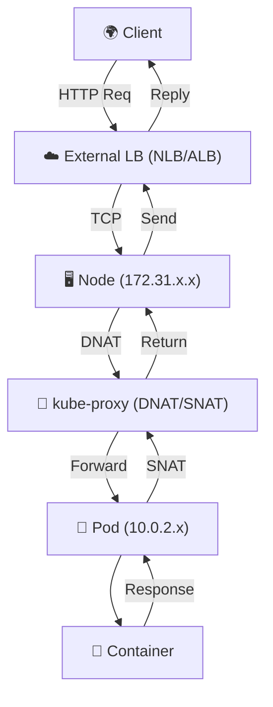

## SRE 實戰心法 — NAT Debug 三招
1️⃣ 查 NAT Table：

```sudo iptables -t nat -L -n -v | grep 10.0.2.15```


2️⃣ 查 conntrack：

```sudo conntrack -L | grep 10.0.2.15```


3️⃣ 檢查 Service ExternalTrafficPolicy：

```kubectl get svc myapp -o yaml | grep ExternalTrafficPolicy```


若是 Local，Pod 回應會保持原始 Client IP（不 SNAT）；
若是 Cluster，會經過 SNAT（來源變 Node IP）。

## 總結
| 類型                            | 動作                    | 說明              |
| ----------------------------- | --------------------- | --------------- |
| DNAT                          | Service IP → Pod IP   | 進入叢集            |
| SNAT                          | Pod IP → Node IP      | 離開叢集            |
| conntrack                     | NAT 映射表               | 保持封包對稱          |
| ExternalTrafficPolicy=Local   | 不 SNAT、保留真實 Client IP | 必開於多 Node LB 模式 |
| ExternalTrafficPolicy=Cluster | SNAT，節點隨機回覆           | 比較安全但無原始 IP     |


## 理解 Pod 間封包流向 + Service Mesh（Istio/Cilium Service Graph）視圖
Pod ↔ Pod 的封包在 Kubernetes 中走的是 CNI 網路 (Layer 3)，
而 Service Mesh 則在 Layer 7 攔截、標記、追蹤封包，
把每個 HTTP call 都變成可觀測的「事件」。

## Pod ↔ Pod 網路流向（無 Mesh）
先看最純粹的情境：沒有 Istio、沒有 Sidecar，純 CNI 直連。

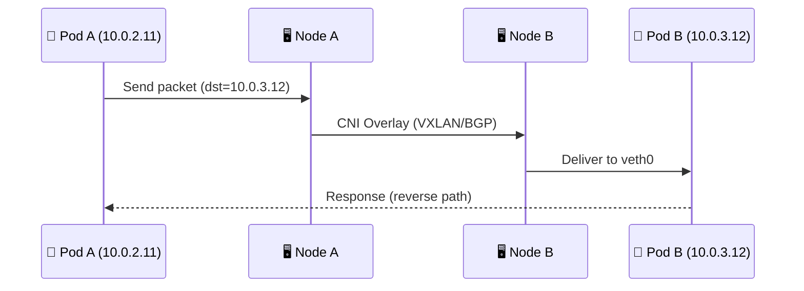

解析
| 元件                  | 功能              | 技術重點                      |
| ------------------- | --------------- | ------------------------- |
| **veth pair**       | Pod ↔ Node 的虛擬線 | CNI 創建                    |
| **Bridge / vxlan0** | Node 間封裝傳輸      | overlay                   |
| **CNI Plugin**      | 處理封包路由          | Calico / Cilium / Flannel |
| **Routing Table**   | 決定要走哪個 Node     | 由 CNI 控制                  |

➡️ 封包層級：IP 層 (L3)，走 VXLAN / BGP。

## 有 Service Mesh 時（例如 Istio）
Service Mesh 加入後，封包會多經過一層「Sidecar Proxy」。

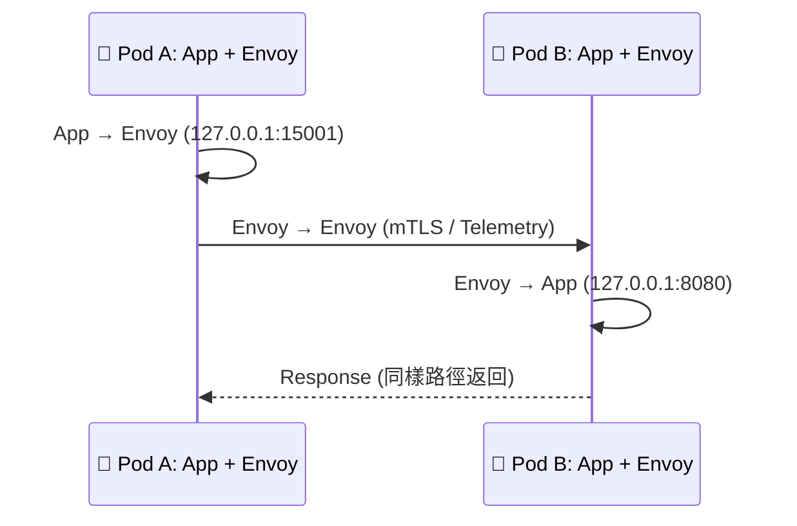

解析
| 層級 | 元件          | 功能                 | 備註                       |
| -- | ----------- | ------------------ | ------------------------ |
| L4 | iptables    | 將 App 出站導向 Sidecar | Istio init container 設規則 |
| L7 | Envoy Proxy | 攔截 HTTP/gRPC，做流量控制 | 可記錄 trace/span           |
| L7 | Istiod      | 控制平面，發送配置到 Envoy   | 與 OpenTelemetry 整合       |
| L3 | CNI         | 管理 Pod 間真實封包傳輸     | Calico / Cilium          |


## 封包轉送圖

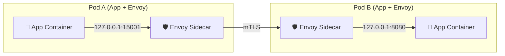

## Service Mesh 內部封包層次對照表
| 層級 | 封包內容              | 負責者             |
| -- | ----------------- | --------------- |
| L7 | HTTP / gRPC / SQL | Envoy Proxy     |
| L4 | TCP / TLS / mTLS  | Sidecar / Envoy |
| L3 | IP Routing        | CNI Plugin      |
| L2 | VXLAN / Overlay   | Node Kernel     |
| L1 | 實體 NIC            | Node 網卡         |


## 在 Mesh 內追蹤一個封包（實際 Trace 流）
1️⃣ App Container 呼叫外部 API：
- 例如 GET /api/user → 被 iptables 攔截轉送到 Envoy (127.0.0.1:15001)

2️⃣ Envoy Proxy (Client Side)
- 加入 Trace Header（如 x-request-id, traceparent）
- 建立 mTLS 連線
- 傳遞給目標 Pod 的 Envoy

3️⃣ Envoy Proxy (Server Side)
- 驗證證書
- 記錄 metrics (latency, bytes)
- 傳給本地 App (127.0.0.1:8080)

4️⃣ App 回傳 Response → Envoy 回包 → 對方 Envoy → App

5️⃣ 同時，Telemetry 送出到：
- Prometheus（metrics）
- Loki（logs）
- Tempo（traces）

## 整合觀察圖：CNI + Service Mesh + Telemetry

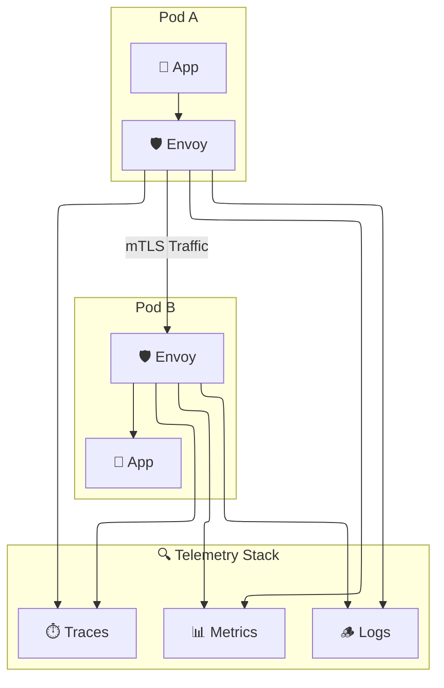

## 費曼法小結
- Kubernetes 是道路；CNI 是柏油；Service Mesh 是監視攝影機。
- 沒有 Mesh：你知道有車在跑，但不知道誰是司機。
- 有了 Mesh：你能知道誰開的車、去哪裡、花多久。
- 有了 Telemetry（Otel + Tempo + Loki）：你甚至能回放整段影片。

## 總結
| 層級   | 名稱                   | 負責範圍                      | 工具 / 協定                   |
| ---- | -------------------- | ------------------------- | ------------------------- |
| L3   | CNI Network          | Pod ↔ Pod 封包傳輸            | Calico / Cilium / Flannel |
| L4   | Transport            | TCP / TLS 連線              | Envoy / Istio Sidecar     |
| L7   | Application          | HTTP / gRPC / SQL         | Envoy / OpenTelemetry     |
| 可觀測性 | Trace / Log / Metric | Tempo / Loki / Prometheus |                           |
