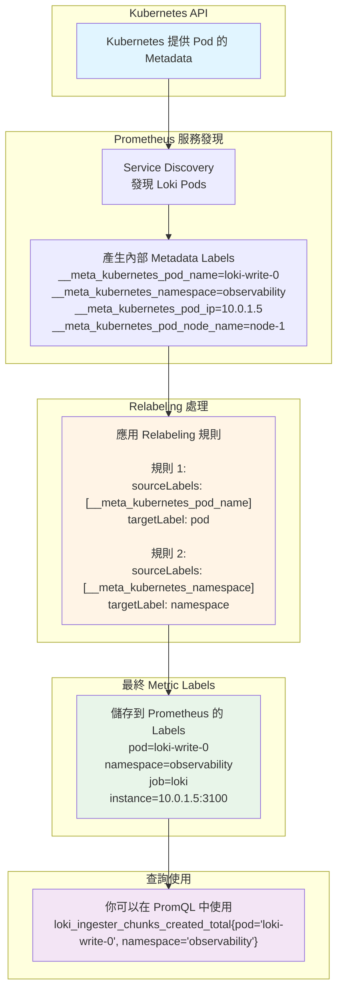

# 2025-10-14 - Prometheus 如何自動發現並監控 Loki (費曼學習法)

> **TL;DR:** Prometheus Operator 就像一個社區的郵差系統。我們只需要給它一份寫有「Loki 住戶特徵」的 **投遞清單 (ServiceMonitor)**，它就能自動找出所有 Loki 的 Pod，並持續地去 **收信 (抓取指標)**，即使 Pod 的地址（IP）變了也沒問題。

---

## 🌍 WHY - 核心故事/問題

在 Kubernetes 這種動態環境中，Pod 會隨時被創建、銷毀，IP 地址也會一直變化。那麼，Prometheus 究竟是如何像有魔法一樣，總能準確地知道 Loki 的所有 Pod 在哪裡，並持續監控它們的 `/metrics` 端點呢？如果每次 Loki Pod 重啟都要手動去改 Prometheus 的設定，那也太不切實際了。

---

## 💡 THE BIG IDEA - 核心類比：社區的郵差系統

為了理解 Prometheus Operator 的自動化機制，我們可以把它想像成一個高度智能化的「**社區郵差系統**」。

1.  **Prometheus Operator (郵局總部):** 這是整個社區的郵務管理中心。它手上有整個社區所有住戶的最新名冊（從 Kubernetes API Server 取得）。

2.  **`ServiceMonitor` (郵差的投遞清單):** 我們作為社區管理員，不用告訴郵差每一戶的門牌號碼。我們只需要給郵差一份 **投遞清單**，上面寫著這樣的規則：「**請找出所有門上貼著『紅色Loki』標籤的住戶，並且每天早上九點去他們家的『metrics』信箱收信。**」

3.  **`selector` (篩選條件):** 清單上的 `selector: { app: "loki" }` 就是那個「**門上貼著『紅色Loki』標籤**」的篩選規則。郵差會根據這個規則，在郵局總部的名冊上篩選出所有符合條件的住戶。

4.  **`relabel_configs` (地址整理與備註):** 在郵差出發前，他會對篩選出來的地址清單做最後的整理。例如：
    * **`action: keep`**: 「只保留那些信箱上寫著『我是主要信箱』的住戶。」（過濾掉不重要的目標）
    * **`action: replace`**: 「如果地址上寫的是『Loki社區 A棟』，請在郵遞區號欄位自動填上『101』。」（從一個標籤的值，生成另一個新的標籤）
    * **`action: labelmap`**: 「把住戶門上所有便利貼（Pod Labels）的內容，都抄一份到我的投遞日誌上。」（快速複製標籤）

5.  **Scraping (收信):** 最後，郵差拿著整理好的最終投遞清單，挨家挨戶地去敲門（訪問 Pod IP 的 `/metrics` 端口），並把信件（指標數據）收回來。

> **核心結論：** 我們從頭到尾都沒有給郵差具體的門牌號碼。我們只給了他一套「**規則**」，剩下的「**自動發現**」和「**持續更新**」都由這個智能化的郵差系統自動完成了。

---

## 🧩 WHAT - 核心概念拆解

_(現在，將上面的類比，逐一對應到技術術語上)_

- **`Prometheus Operator` (郵局總部):**</br>
    - 一個 Kubernetes Operator，它會監聽 `ServiceMonitor` 和 `PodMonitor` 這類自定義資源 (CRD)，並根據這些資源的定義，自動生成 Prometheus 所需的 `scrape_configs`。

- **`ServiceMonitor` vs. `PodMonitor` (兩種投遞清單):**</br>
    - **`ServiceMonitor`**: 監控一個 Kubernetes **Service** 所暴露的端點。這是最常用、也是推薦的方式，因為 Service 提供了一個穩定的訪問入口。**適用場景：** 監控 Loki 的 `read`, `write`, `backend` 這些有對應 Service 的組件。
    - **`PodMonitor`**: 直接監控符合條件的 **Pod**。**適用場景：** 當某些應用沒有對應的 Service，或者你需要監控一些特殊的 Pod 時使用。

- **`selector` (篩選條件):**</br>
    - `ServiceMonitor` 中的 `selector.matchLabels` 用來找到對應的 **Service**。
    - 找到 Service 後，Service 本身會通過自己的 `selector` 找到後端的 Pods。

- **`relabel_configs` (地址整理與備註 - 精華所在):**</br>
    - 這是在 Prometheus 抓取目標前，對目標的標籤 (Labels) 進行動態修改的一系列規則。
    - **`1. Mermaid 視覺化流程`**</br>
    為了理解 relabel_configs 在整個監控鏈路中的位置，我們可以參考下面的流程圖。它展示了一個 Pod 的原始標籤是如何一步步被轉換成 Prometheus 最終抓取時使用的標籤的。
    ```mermaid
    graph TD
    subgraph "Kubernetes 環境"
        A("
            <b>K8s Pod</b><br/>
            <i>name: loki-read-xyz</i><br/>
            <i>label: app=loki</i><br/>
            <i>label: component=read</i>
        ")
    end

    subgraph "Prometheus 內部處理流程"
        B("
            <b>1. Service Discovery</b><br/>
            Prometheus Operator 發現了這個 Pod<br/>
            <i>自動附加 __meta_* 標籤</i>
        ")

        C("
            <b>2. __meta_ 標籤產生</b><br/>
            <i>__meta_kubernetes_pod_name: loki-read-xyz</i><br/>
            <i>__meta_kubernetes_pod_label_app: loki</i><br/>
            <i>__meta_kubernetes_pod_label_component: read</i><br/>
            <i>...還有很多...</i>
        ")

        D{"
            <b>3. relabel_configs 處理引擎</b><br/>
            <i>依序執行規則...</i>
        "}

        E("
            Rule 1: action: keep<br/>
            <i>(例如: 只保留 __meta_kubernetes_pod_label_app 為 'loki' 的目標)</i>
        ")

        F("
            Rule 2: action: replace<br/>
            <i>(例如: 將 __meta_..._component 的值 'read' 寫入新的 'component' 標籤)</i>
        ")

        G("
            <b>4. 最終目標標籤</b><br/>
            <i>job: loki</i><br/>
            <i>component: read</i><br/>
            <i>instance: 10.1.2.3:3100</i><br/>
            <i>...整理後的乾淨標籤...</i>
        ")
    end

    subgraph "最終動作"
        H("
            <b>5. Scrape (抓取)</b><br/>
            Prometheus 前往 Pod 的 /metrics 端點抓取指標
        ")
    end

    A --> B --> C --> D
    D --> E --> F --> G
    G --> H
    ```

    📖 實際情境：從 Pod 到 Metric 的旅程
    ```mermaid
    sequenceDiagram
        participant K8s as Kubernetes API
        participant Prom as Prometheus
        participant SD as Service Discovery
        participant Relabel as Relabeling Engine
        participant TSDB as Time Series DB
        
        Note over K8s: Loki Pod 正在運行
        K8s->>SD: 回報 Pod 資訊
        Note over SD: Pod Name: loki-write-0<br/>Namespace: observability<br/>IP: 10.0.1.5<br/>Node: ip-10-0-1-100
        
        SD->>Prom: 發現新 Target
        Note over Prom: 產生內部 Metadata:<br/>__meta_kubernetes_pod_name<br/>__meta_kubernetes_namespace<br/>__meta_kubernetes_pod_ip<br/>...
        
        Prom->>Relabel: 套用 Relabeling 規則
        
        rect rgb(255, 244, 230)
            Note over Relabel: 規則 1 執行:<br/>從 __meta_kubernetes_pod_name<br/>複製到 pod
            Note over Relabel: 規則 2 執行:<br/>從 __meta_kubernetes_namespace<br/>複製到 namespace
        end
        
        Relabel->>Prom: 返回處理後的 Labels
        Note over Prom: 最終 Labels:<br/>pod="loki-write-0"<br/>namespace="observability"<br/>job="loki"
        
        Prom->>TSDB: 抓取 Metrics 並附加 Labels
        Note over TSDB: 儲存:<br/>loki_ingester_chunks_created_total{<br/>  pod="loki-write-0",<br/>  namespace="observability",<br/>  job="loki"<br/>} 42
    ```
    - **`2. 我該如何知道有哪些 source_labels 可以用？ (尋寶指南)`**:</br>
    這是一個至關重要的問題。答案是：Prometheus 的 Web UI 就是你的藏寶圖。它會明確地告訴你，對於每一個它發現的目標，都有哪些 __meta_ 元數據標籤可供你使用。</br>
        1. 進入 Prometheus UI:
        ```       
        # 找到你的 Prometheus Pod
        kubectl get pods -n $namespace
        # 轉發端口到本地
        kubectl port-forward -n $namespace <prometheus-pod-name> 9090
        ```
        然後在瀏覽器中打開 http://localhost:9090。</br>
        
        2. 前往 Status -> Service Discovery 頁面:</br>
這個頁面是除錯 relabel_configs 的黃金標準！它會列出 Prometheus 通過所有服務發現方式（包括 ServiceMonitor）找到的所有目標，以及這些目標在經過 relabel_configs 處理前的原始標籤。</br>
        
        3. 找到你的 Loki 目標:
頁面上會有一個長長的列表，每個區塊對應一個 ServiceMonitor 或 scrape_config。找到與 Loki 相關的那個區塊，通常會以 `ServiceMonitor/<namespace>/<servicemonitor-name>`命名。</br>
        
        4. 檢查可用標籤:</br>
        在 Loki 的目標列表中，你會看到每個 Pod Target 以及它所附帶的一長串標籤。所有以 __meta_ 開頭的標籤，都可以被用在 relabel_configs 的 source_labels 中。
            #### Path: Status > Service discovery ####

          "Target labels" 是最終會被附加到從這個目標 (Target) 抓取下來的每一條指標 (Metric) 上的基礎標籤。但您在 Grafana 中看到的完整標籤，是 "Target labels" 加上指標本身自帶的標籤。


        你會看到類似這樣的資訊 (點擊 "Show more" 展開)：
        ```
        # 這是在 relabeling 之前的原始標籤
        __address__: "10.1.2.3:3100"
        __meta_kubernetes_namespace: "observability"
        __meta_kubernetes_pod_name: "loki-read-6f7b8c9d-xyz"
        __meta_kubernetes_pod_ip: "10.1.2.3"
        __meta_kubernetes_pod_label_app_kubernetes_io_component: "read"
        __meta_kubernetes_pod_label_app_kubernetes_io_instance: "loki"
        __meta_kubernetes_pod_label_app_kubernetes_io_name: "loki"
        __meta_kubernetes_service_name: "loki-read"
        __meta_kubernetes_service_port_name: "http-metrics"
        job: "observability/loki-read"
        ```

    - **`3. 常見的 source_labels 分類`**:</br>
    當你看到這一大堆 __meta_ 標籤時，可以把它們歸為幾類來幫助理解：
    ```
        Pod 相關:

        __meta_kubernetes_pod_name: Pod 的名稱 (e.g., loki-read-xyz)

        __meta_kubernetes_pod_ip: Pod 的 IP 地址

        __meta_kubernetes_pod_label_<labelname>: Pod 上的某個標籤 (e.g., __meta_kubernetes_pod_label_app_kubernetes_io_component)

        __meta_kubernetes_pod_annotation_<annotationname>: Pod 上的某個註解 (Annotation)

        Service 相關:

        __meta_kubernetes_service_name: 匹配到的 Service 的名稱 (e.g., loki-read)

        Namespace 相關:

        __meta_kubernetes_namespace: Pod 所在的 Namespace (e.g., observability)

        Node 相關:

        __meta_kubernetes_node_name: Pod 所在節點的名稱
    ```

    有了這個「尋寶圖」(Prometheus UI 的 Service Discovery 頁面)，就可以精確地知道有哪些 source_labels 可用，並自信地編寫 relabel_configs 規則，從中提取需要的資訊，將其轉換為乾淨、有意義的最終指標標籤了。

---
## 一個完整的標籤是如何誕生的？
讓我們把這個過程想像成給一個產品貼標籤：

"Discovered labels" (原料標籤):
這是產品從生產線下來時，所有能描述它的原始資訊。非常多、很雜亂，包含了 __meta_ 等各種內部編號。

"Target labels" (產品外盒標籤):
在產品出廠前，我們根據 relabel_configs 規則，從原料標籤中挑選出最重要的資訊，印在產品的外包裝盒上。
在您的截圖中，這個外盒上只印了兩件事：

```
instance="172.30.72.233:3100"

job="loki-direct"
```

指標本身的標籤 (產品內部標籤):
盒子裡的產品本身，還有自己獨特的標籤。例如，Loki 的 /metrics 會回報像這樣的指標：

```
loki_request_duration_seconds_count{route="loki_api_v1_push", status_code="204"}
```
這裡的 route 和 status_code 就是產品的內部標籤。

最終在 Grafana 看到的標籤 = 外盒標籤 + 內部標籤
所以，當 Prometheus 抓取了上面那條指標後，它會把外盒標籤和內部標籤組合在一起，存儲起來。

最終您在 Grafana 中查詢時，這條指標的完整標籤集將是：

```
{
  "__name__": "loki_request_duration_seconds_count", // 指標名稱
  "instance": "172.30.72.233:3100", // 來自 Target labels
  "job": "loki-direct",                   // 來自 Target labels
  "route": "loki_api_v1_push",            // 來自指標本身
  "status_code": "204"                    // 來自指標本身
}
```



relabelings:
  - sourceLabels: [__meta_kubernetes_pod_name]
    targetLabel: pod
  - sourceLabels: [__meta_kubernetes_namespace]
    targetLabel: namespace


**實際產生的效果：**


| Pod Name | 原始 Label | 處理後的 Label | 你的查詢 |
|----------|-----------|---------------|---------|
| loki-write-0 | `__meta_kubernetes_pod_name="loki-write-0"` | `pod="loki-write-0"` | `{pod="loki-write-0"}` |
| loki-write-1 | `__meta_kubernetes_pod_name="loki-write-1"` | `pod="loki-write-1"` | `{pod="loki-write-1"}` |
| loki-read-0 | `__meta_kubernetes_pod_name="loki-read-0"` | `pod="loki-read-0"` | `{pod="loki-read-0"}` |

| Namespace | 原始 Label | 處理後的 Label | 你的查詢 |
|-----------|-----------|---------------|---------|
| observability | `__meta_kubernetes_namespace="observability"` | `namespace="observability"` | `{namespace="observability"}` |


---
## 關鍵要點總結

### **用一句話解釋：**

> **Relabeling 就是把 Kubernetes 給的「內部編號」翻譯成「人類看得懂的標籤」，讓你可以用有意義的名稱查詢 metrics。**

### **記住這個流程**

    Kubernetes Pod 資訊
        ↓
    Prometheus 發現並產生 __meta_* labels
        ↓
    Relabeling 規則：複製、轉換、過濾
        ↓
    產生最終的 labels（移除 __ 開頭的）
        ↓
    儲存到 Prometheus
        ↓
    你可以用這些 labels 查詢了！
    ## 🔧 進階：Relabeling 的完整能力
    
  ### 1. 簡單複製（目前用的）
  relabelings:
  - sourceLabels: [__meta_kubernetes_pod_name]
    targetLabel: pod
  
  ### 2. 從多個 source 組合
  - sourceLabels: [__meta_kubernetes_namespace, __meta_kubernetes_pod_name]
    separator: "/"
    targetLabel: full_name
    #### 結果: full_name="observability/loki-write-0"
  
  ### 3. 用正則表達式提取部分內容
  - sourceLabels: [__meta_kubernetes_pod_name]
    regex: 'loki-(.+)-\d+'
    targetLabel: component
    #### 結果: component="write" (從 loki-write-0 提取)
  
  ### 4. 替換內容
  - sourceLabels: [__meta_kubernetes_pod_name]
    regex: 'loki-(.*)'
    replacement: 'prod-$1'
    targetLabel: env_pod
    #### 結果: env_pod="prod-write-0"
  
  ### 5. 條件保留（只保留特定的 targets）
  - sourceLabels: [__meta_kubernetes_pod_label_app_kubernetes_io_component]
    regex: 'write'
    action: keep
    #### 只保留 component=write 的 pods
  
  ### 6. 條件丟棄
  - sourceLabels: [__meta_kubernetes_namespace]
    regex: 'kube-system'
    action: drop
    #### 不監控 kube-system namespace 的 pods

---

### **`Prometheus instance 標籤的來源：`** ###
它是由 Prometheus 服務發現 (Service Discovery) 機制在抓取目標時自動生成或通過 relabel_configs 配置的。

它的典型值是目標的 IP:Port，目的是唯一標識一個被抓取指標的端點 (scrape target)。

它的生命週期只存在於 Prometheus 的時序數據庫 (TSDB) 中。

---

## 🛠️ HOW - 一個完整的 ServiceMonitor 範例

這是一個監控 Loki `read` 組件的 `ServiceMonitor` 實際範例：
<details>
<summary>範例</summary>

```yaml
apiVersion: [monitoring.coreos.com/v1](https://monitoring.coreos.com/v1)
kind: ServiceMonitor
metadata:
  name: loki-read-servicemonitor
  labels:
    # 這個 label 很重要，Prometheus Operator 會靠它來找到這個 ServiceMonitor
    release: prometheus
spec:
  # 1. 篩選 Service (郵差先找到對應的 Service)
  selector:
    matchLabels:
      # 告訴 Prometheus，請去找那個標籤為 app.kubernetes.io/component: read 的 Service
      app.kubernetes.io/component: read
      app.kubernetes.io/name: loki

  # 2. 指定監控端點 (告訴郵差要去哪個信箱收信)
  endpoints:
  - port: http-metrics  # Service 中定義的 metrics 端口名稱
    interval: 30s       # 每 30 秒收一次信
    path: /metrics      # 信箱的具體路徑

    # 3. 整理標籤 (郵差對地址做最後的整理)
    relabel_configs:
    - source_labels: [__meta_kubernetes_pod_label_app_kubernetes_io_instance]
      target_label: cluster
      # 範例：將 Pod 的 instance 標籤，變成指標中的 cluster 標籤

  # 4. Namespace 篩選 (郵差只在這個社區送信)
  namespaceSelector:
    matchNames:
    - observability # Loki 所在的 namespace
```

</details>

---

🎓 費曼測驗：你真的懂了嗎？
試著回答這些問題：

為什麼 __meta_kubernetes_pod_name 不能直接在 PromQL 查詢？
<details>
<summary>答案</summary>
因為所有 `__` 開頭的 labels 在抓取完成後會被 Prometheus 丟棄，不會儲存到 TSDB。


#### Labels starting with __ will be removed from the label set after target relabeling is completed.

If a relabeling step needs to store a label value only temporarily (as the input to a subsequent relabeling step), use the __tmp label name prefix. This prefix is guaranteed to never be used by Prometheus itself.

來源：https://prometheus.io/docs/prometheus/latest/configuration/configuration/#relabel_config
</details>

如果沒有 relabeling，你只能用什麼 label 查詢？
<details>
<summary>答案</summary>
只能用 `job` 和 `instance` (IP:Port)，很難辨識具體是哪個 Pod。</br>

來源：https://github.com/prometheus-operator/prometheus-operator/blob/main/Documentation/api.md#servicemonitor
</details>

Pod 重啟後 IP 變了，relabeling 後的 pod label 會變嗎？
<details>
<summary>答案</summary>
不會！因為 `pod` label 來自 Pod 名稱，StatefulSet 的 Pod 名稱是固定的（如 loki-write-0）。
</details>