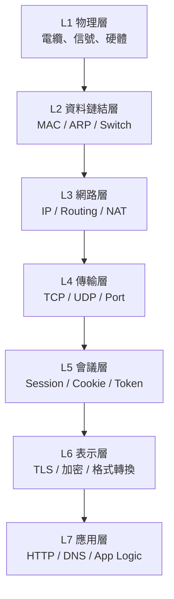
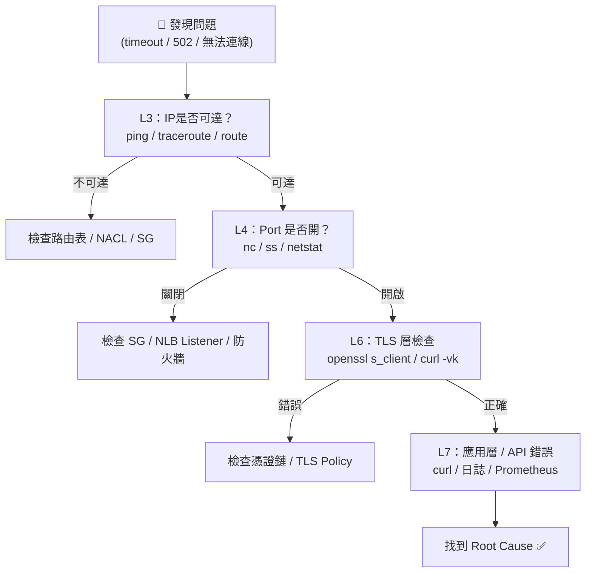
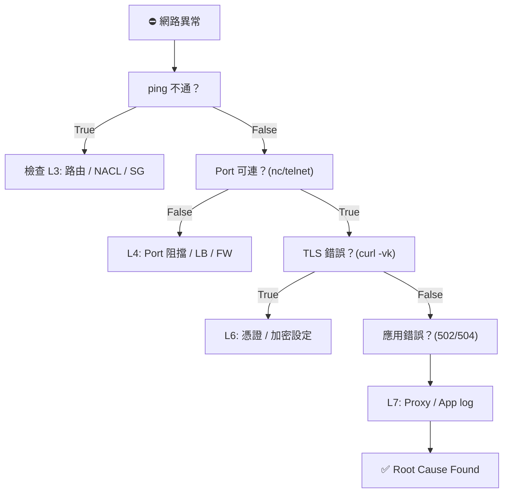

# L2–L7 網路排查 Runbook

> 📘 SRE Runbook 範本  
> 🧠 目標：快速從 OSI 模型第 2 層到第 7 層定位並解決網路問題  
> ⚙️ 適用環境：Linux / Container / Kubernetes / Cloud

---

## OSI 模型概觀



## 整體排查流程圖



## 各層常見排查工具與指令
| 層級           | 主要職責                          | 常用工具                                                           | 典型指令範例                                                                                               |
| ------------ | ----------------------------- | -------------------------------------------------------------- | ---------------------------------------------------------------------------------------------------- |
| **L2 資料鏈結層** | MAC, ARP, VLAN                | `arp`, `ip neigh`, `tcpdump -e`, `brctl`, `ethtool`            | `arp -a` <br> `ip neigh show` <br> `sudo tcpdump -e arp`                                             |
| **L3 網路層**   | IP, 路由, NAT                   | `ping`, `traceroute`, `mtr`, `ip route`, `iptables`, `tcpdump` | `ping 8.8.8.8` <br> `ip route get 1.1.1.1` <br> `traceroute example.com`                             |
| **L4 傳輸層**   | TCP/UDP, Port, 三次握手           | `ss`, `netstat`, `nc`, `telnet`, `conntrack`, `tcpdump`        | `ss -tulwn` <br> `nc -vz example.com 443` <br> `sudo tcpdump port 443`                               |
| **L5 會議層**   | Session / Cookie / Stickiness | `curl -b`, Browser DevTools, Redis, `wscat`                    | `curl -v -b "sess=abc" https://example.com` <br> `redis-cli GET session:sess_abc`                    |
| **L6 表示層**   | TLS / 加解密 / 壓縮                | `openssl s_client`, `sslscan`, `curl -vk`                      | `openssl s_client -connect example.com:443 -showcerts` <br> `curl -vk --tlsv1.2 https://example.com` |
| **L7 應用層**   | HTTP, DNS, API, App           | `curl`, `httpie`, `dig`, `kubectl logs`, `ngrep`               | `curl -v https://example.com/api` <br> `dig example.com` <br> `kubectl logs -f myapp`                |


## L2
> 主要任務： 檢查 MAC、ARP、橋接、VLAN </br>
> 常見問題： MAC 位址重複、ARP cache 異常、container veth 斷線 </br>

### Tips:
- 若在 K8s，Pod 與 Node 之間常透過 veth pair(*#Todo-Q1*)。
- 觀察 CNI plugin (Calico/Flannel) 建立的虛擬介面狀態。

## L3
> 主要任務： 檢查 IP 配置、路由表、跨子網連通性 </br>
> 常見問題： 路由錯誤、NACL 阻擋、VPC Peering 配置錯誤 </br>

### Tips:
- 雲端環境：檢查 Security Group、Route Table、NACL(*#Todo-Q2*)。
- 若使用 NAT Gateway，請確認 SNAT / DNAT 正常。

## L4
> 主要任務： Port 監聽、三次握手、連線追蹤 </br>
> 常見問題： Connection refused / timeout / RST(*#Todo-Q3*) </br>

### Tips:
- Connection refused = port 未開或 SG 阻擋
- Timeout = 上游無回應或 L7 proxy 錯誤

## L5
> 主要任務： Session、Cookie、Stickiness、WebSocket </br>
> 常見問題： 登入後跳出、Session 掉、不同節點 Session 不一致 </br>

### Tips:
- 負載平衡器（ALB/Nginx）stickiness(*#Todo-Q4*) 問題常見於此層。
- Token / Cookie 問題 ≠ TLS 錯誤，要分清 L5 vs L6。

## L6
> 主要任務： 憑證、加密、壓縮、編碼格式 </br>
> 常見問題： HTTPS 憑證錯誤、TLS 版本不符、gzip 壓縮錯亂 </br>

### Tips:
- 憑證錯誤 90% 是中間鏈未配置完整。
- JWT 驗簽失敗通常是 L6 層簽名/編碼錯誤，不是應用 Bug。

## L7
> 主要任務： HTTP、DNS、API、應用邏輯、反向代理 </br>
> 常見問題： 502/504、DNS 錯誤、Header 缺失、App 錯誤 </br>

### Tips:
- 502 → 通常是後端無回應 (upstream fail)
- 504 → timeout
- DNS 錯誤請確認 /etc/resolv.conf 與外部 resolver 可達

---

## 快速對照表
| 層級 | 常見問題               | Debug 工具                           | 關鍵命令                         |
| -- | ------------------ | ---------------------------------- | ---------------------------- |
| L2 | MAC / ARP 錯誤       | `tcpdump -e` / `ip neigh`          | `arp -a`                     |
| L3 | 路由錯誤 / 不通          | `ping`, `traceroute`, `ip route`   | `ip route get`               |
| L4 | Port 關閉 / Timeout  | `nc`, `ss`, `conntrack`            | `nc -vz host port`           |
| L5 | Session 掉 / 登入失效   | `curl -b`, `redis-cli`, `DevTools` | `curl -v -b cookie`          |
| L6 | 憑證錯誤 / 加密失敗        | `openssl`, `curl -vk`              | `openssl s_client -connect`  |
| L7 | 502 / API 錯誤 / DNS | `curl`, `dig`, `kubectl logs`      | `curl -v`, `dig example.com` |

| 層級 | 關鍵概念         | 常見現象                     | 代表工具                   |
| -- | ------------ | ------------------------ | ---------------------- |
| L2 | 資料傳輸單元：Frame | ARP fail / VLAN mismatch | `arp`, `tcpdump -e`    |
| L3 | IP 傳遞路徑      | ping 不通 / Route 錯        | `ping`, `mtr`          |
| L4 | 傳輸協定         | Connection refused       | `ss`, `nc`, `tcpdump`  |
| L5 | 狀態管理         | Session 掉線               | `curl -b`, `redis-cli` |
| L6 | 加密層          | 憑證錯誤                     | `openssl`, `curl -vk`  |
| L7 | 應用協定         | 502/504, DNS fail        | `curl`, `dig`, `logs`  |


## 封包分析工作流 (L2 -> L4)
```
# 抓封包保存
sudo tcpdump -i eth0 -w /tmp/trace.pcap

# 即時觀察
sudo tcpdump -n -i eth0 host 1.2.3.4 and port 443

# 分析特定 TCP Stream
tshark -r trace.pcap -z follow,tcp,ascii,1
```

## 一頁決策樹



## 小結
| 層級 | 關鍵概念         | 常見現象                     | 代表工具                   |
| -- | ------------ | ------------------------ | ---------------------- |
| L2 | 資料傳輸單元：Frame | ARP fail / VLAN mismatch | `arp`, `tcpdump -e`    |
| L3 | IP 傳遞路徑      | ping 不通 / Route 錯        | `ping`, `mtr`          |
| L4 | 傳輸協定         | Connection refused       | `ss`, `nc`, `tcpdump`  |
| L5 | 狀態管理         | Session 掉線               | `curl -b`, `redis-cli` |
| L6 | 加密層          | 憑證錯誤                     | `openssl`, `curl -vk`  |
| L7 | 應用協定         | 502/504, DNS fail        | `curl`, `dig`, `logs`  |

---
1) traceroute / mtr — 「路由與每跳延遲」

情境：可以 ping 外網但對某服務很慢或不通，想看到哪一跳開始有問題。

traceroute example.com

看每一跳（hop）的 RTT 與路由器 IP，找到哪一段延遲或丟包開始。

mtr -rw example.com

mtr 結合 ping + traceroute，會持續統計每跳丟包與延遲（互動/報告模式）。

看什麼：哪一跳的 packet loss > 0 或 RTT 大跳升 → 那一節點或其後網段有問題。

範例：

traceroute example.com
mtr -rw example.com
---

2) ss（或 netstat）— 「檢查本機 socket 與 listening port」

情境：服務端口應該開著但客戶端連不上，先確認目標機器上該端口是否在 listen。

ss -tulwn：列出 TCP/UDP listening 與現存連線（比 netstat 現代）。

LISTEN 表示服務在那台機器上有在監聽。

ss -tn sport = :443（篩選某 port）

範例：

ss -tulwn
ss -tn state listening '( sport = :443 )'


看什麼：有無 LISTEN；來源 IP 是否有很多 ESTAB（代表連線被建立或有大量客戶端）。
---

3) nc / telnet — 「快速測試 TCP port 是否可到達」

情境：想驗證 443/80/5432 等端口是否能連通（不看應用內容）。

nc -vz host port（簡單檢查）

telnet host port（也常用）

範例：

nc -vz example.com 443
telnet example.com 80


看什麼：

成功會顯示 succeeded 或連上後空白（telnet）。

失敗：Connection refused（port 關）或 Operation timed out（被 firewall/NAT 丟棄）。
---

4) curl（含 -v, -L, -b, -c）— 「HTTP / cookie / TLS 快速偵測」

情境：測 API 回傳 / 502 / TLS 錯誤 / session cookie 行為。

curl -v https://example.com/path：verbose，顯示 TLS 握手、request headers、response headers。

curl -I https://example.com：只拿 header（快速看 status / content-type / cookie）

curl -L -v http://example.com：跟隨 redirect

curl -b "session_id=xxx" https://example.com/dashboard：-b 帶 cookie（可直接寫 cookie 字串或用 cookie 檔）

不是「browser」，是告訴 curl 要帶哪些 cookie 給目標站（模擬瀏覽器帶 cookie）

curl -c cookies.txt -b cookies.txt -L -v ...：-c 寫 cookie，-b 讀 cookie

範例：

### 只看 header
curl -I https://example.com

### verbose + follow redirect
curl -L -v https://example.com/login

### 帶 cookie 模擬已登入
curl -v -b "session_id=sess_abc123" https://example.com/dashboard

### 讀寫 cookie 檔（模擬瀏覽器行為）
curl -c cookies.txt -L -v https://example.com/login
curl -b cookies.txt -v https://example.com/dashboard


看什麼：

HTTP status（200/302/401/403/502/504）→ 定位 L7

Header Set-Cookie、Location（redirect）

TLS 錯誤會在 verbose 裡顯示（handshake fail、certificate verify failed）

補充：-b 可接受 cookie 檔或 cookie 字串；不是指「browser」。
---

5) tcpdump — 「抓封包（L2–L4）」

情境：要確認封包是否抵達、是否有 SYN/ACK、是否遭到 RST 或被 firewall 丟棄，或檢查某些 packet 的原始內容（HTTP）。

最常用：

### 抓指定 host 與 port，存檔以便 Wireshark 分析
sudo tcpdump -i eth0 host 1.2.3.4 and port 443 -w /tmp/cap.pcap

### 即時顯示簡單 ASCII（不要在高流量介面跑）
sudo tcpdump -A -i eth0 'tcp port 80'

### 只看三次握手（SYN）
sudo tcpdump -i eth0 'tcp[tcpflags] & (tcp-syn|tcp-ack) != 0'


看什麼：

SYN → SYN-ACK → ACK（正常三次握手）

如果看到 SYN 後無 SYN-ACK → 代表目標沒有回應（L3/L4 問題、防火牆丟包）

若看到 RST → 對方拒絕（Connection refused）

有沒有重傳、延遲（retransmit）

小心：抓封包需 root，且可能有隱私 / 合規問題。
---

6) openssl s_client — 「檢查 TLS / certificate」

情境：HTTPS 握手問題、憑證鏈、SNI、協議版本。

### 基本 TLS 檢查
openssl s_client -connect example.com:443 -servername example.com

### 顯示所有證書（chain）
openssl s_client -connect example.com:443 -servername example.com -showcerts

### 只取證書內容（人可讀）
echo | openssl s_client -connect example.com:443 -servername example.com 2>/dev/null | openssl x509 -noout -text


看什麼：

Verify return code（0 = ok）

是否有完整 certificate chain

TLS 協議 (TLS1.2/TLS1.3) 與 cipher

---

7) dig（DNS） — 「DNS 查詢」

情境：域名解析錯誤或緩慢。

dig +short example.com
dig @8.8.8.8 example.com A
dig example.com ANY


看什麼：A / CNAME / TTL 是否正確；是否查到預期 IP。

---

8) mtr（已在 1）與 traceroute 重複，省略。
其他你列的工具（簡短說明與入門用法）

iptables：檢查/設定 Linux 防火牆規則

sudo iptables -L -n -v

conntrack：查看 Linux 的 conntrack（NAT 追蹤表）

sudo conntrack -L | grep 1.2.3.4

netstat：功能類似 ss（舊）

netstat -tulpn

httpie：比 curl 更友好的 HTTP CLI（語法直觀）

http GET https://example.com/api

ngrep：用類似 grep 的方式抓 HTTP 原始字串（方便找 header/payload）

sudo ngrep -d eth0 '' 'port 80'

sslscan：針對 TLS 套件掃描（支援哪些 ciphers / 協議）

sslscan example.com

telnet：簡單測 port（見 nc）

A. 「網站無法打開」快速排查（1–2 分鐘）

```
# 1. DNS?
dig +short example.com
# 找不到或 IP 不正確 → DNS 問題（L7）

# 2. IP 可達？
ping -c 4 1.2.3.4    # (上一步拿到的 IP)
# 若 ping 不通，改 traceroute → 找到哪一跳不通（L3）

# 3. Port 可連？
nc -vz example.com 443
# Connection refused / timed out → L4 (port / firewall)

# 4. TLS?
openssl s_client -connect example.com:443 -servername example.com
# 檢查 cert 與 verify code（L6）

# 5. 若以上都正常，看應用日誌（L7）
curl -v https://example.com/path
kubectl logs -f deploy/myapp   # 或 tail /var/log
```

B. 「API 回 502」快速排查（3–5 分鐘）

```
# 1. 確認 ALB/Nginx 有沒有 upstream 健康
curl -v https://example.com/api/health

# 2. 檢查 backend 是否 listen
ss -tulwn | grep 8080

# 3. 從 proxy 機器抓封包看 upstream 是否有回應
sudo tcpdump -i eth0 host backend-ip and port 8080 -w /tmp/back.pcap

# 4. 看 application log
kubectl logs -f deploy/myapp
```

關於你問的：curl -b 是什麼？

-b 或 --cookie：指定要帶到 server 的 cookie。

可以是 cookie 字串：-b "session_id=abc; other=xyz"

或是一個 cookie 檔案路徑（curl 可讀取該檔裡的 cookies）

不是代表「browser」。它只是模擬瀏覽器帶 cookie 的行為，等同於 Browser 在請求時自動加上 Cookie: header。

常見搭配：

-c cookies.txt：curl 把回傳的 Set-Cookie 寫到 cookies.txt

-b cookies.txt：之後再用 -b cookies.txt 帶回去（維持 session）

範例：
```
# 登入並存 cookie
curl -c cookies.txt -X POST -d "user=you&pass=..." https://example.com/login

# 帶 cookie 做後續請求
curl -b cookies.txt https://example.com/dashboard
```

快速 Cheat-Sheet（貼牆上用）

```
# DNS
dig +short example.com

# 路由
traceroute example.com
mtr -rw example.com

# Ping
ping -c 4 1.2.3.4

# Port check
nc -vz example.com 443
telnet example.com 80

# Socket
ss -tulwn

# HTTP + Cookie + TLS quick check
curl -L -v -c cookies.txt -b cookies.txt https://example.com

# TLS cert
openssl s_client -connect example.com:443 -servername example.com -showcerts

# Packet capture
sudo tcpdump -i eth0 host 1.2.3.4 and port 443 -w /tmp/cap.pcap

# Follow logs (k8s)
kubectl logs -f deploy/myapp
```