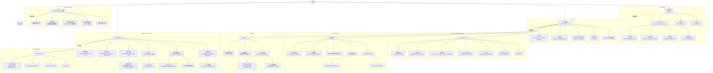

```mermaid
flowchart TD
  start([Start]) --> NET["網路基礎</br>(TCP/IP)"]

  %% ── 網路基礎
  subgraph SG_NET[Networking]
    NET --> L4[Transport<br/>TCP/UDP, QUIC]
    NET --> L3[IP/路由<br/>CIDR, BGP, NAT]
    NET --> L7[HTTP/HTTPS<br/>Methods, Status, Headers]
    L7 --> TLS[TLS/加密握手<br/>PKI, ciphers, H/2,H/3]
    L7 --> DNS[DNS/解析<br/>A/AAAA/CNAME, TTL]
    L7 --> CACHING[快取/代理<br/>ETag, Cache-Control, CDN]
    L7 --> REST["API 風格<br/>REST, GraphQL, gRPC"]
  end

  %% ── Web 面
  start --> WEB["Web 基礎<br/>(HTTP, HTML, JS)"]
  subgraph SG_WEB[Web]
    WEB --> HTML[HTML/ARIA/無障礙]
    WEB --> CSS[CSS/佈局<br/>Flex/Grid]
    WEB --> JS[JavaScript 語言核心<br/>Type/Promise/Async]
    WEB --> BUILD[建置鏈<br/>Babel, Vite, Webpack, TS]
    WEB --> SECW[Web 安全<br/>CORS, CSP, XSS, CSRF, SameSite]
  end

  %% ── Browser API / Internals
  WEB --> BAPI[Browser API]
  subgraph SG_BAPI[Browser Internals & APIs]
    BAPI --> DOM[DOM/BOM]
    BAPI --> FETCH[Fetch/Streaming<br/>Abort, Cache API]
    BAPI --> STORE[Storage<br/>local/session, IndexedDB]
    BAPI --> SW[Service Worker<br/>Lifecycle, Events, Cache]
    BAPI --> RENDER[渲染管線<br/>Parse→Style→Layout→Paint→Composite]
    BAPI --> JIT[JS 引擎/V8<br/>Event Loop, GC, Memory]
    BAPI --> PERF[性能/監測<br/>LCP, CLS, TTI, RUM]
  end

  %% ── Frameworks
  WEB --> FMW[前端框架]
  subgraph SG_FMW[Frameworks]
    FMW --> REACT[React/JSX/Hooks]
    REACT --> RECONCILE[Reconciliation/VDOM]
    REACT --> SSR[SSR/SSG/CSR/Hydration]
    FMW --> VUE[Vue/響應式系統]
    FMW --> NEXT[Next/Nuxt/路由與資料抓取]
    FMW --> STATE[狀態管理<br/>Redux, Zustand, Signals]
    FMW --> TEST[測試/端到端<br/>Jest, Vitest, Playwright]
  end

  %% ── AI/Agent
  WEB --> AI[AI / Agent]
  subgraph SG_AI[AI/Agent]
    AI --> LLM[LLM 基礎<br/>Prompt/Context/Token]
    LLM --> RAG[RAG/向量檢索<br/>Embeddings, Vector DB]
    LLM --> TOOLS[工具/Agent 能力<br/>Function Calling, Orchestration]
    AI --> MATH[數學基礎<br/>機率, 線代, 微積分]
    AI --> ETHICS[隱私/法規/評測<br/>PII, Eval, Bias]
  end

  %% ── 後端/Infra
  start --> BE[Backend/Infra]
  subgraph SG_BE[Backend / OS / Cloud]
    BE --> OS[作業系統<br/>Process/Thread, Syscall, Memory, IO]
    OS --> LINUX[Linux 實務<br/>shell, systemd, perf, eBPF]
    BE --> CONTAINER[容器與虛擬化<br/>cgroups, namespaces]
    CONTAINER --> DOCKER[Docker/映像/網路/卷]
    CONTAINER --> K8S[Kubernetes<br/>Pod/Service/Ingress/Operator]
    BE --> CLOUD[雲平台<br/>AWS/GCP/Azure 基礎]
    CLOUD --> SVC_MESH[Service Mesh<br/>mTLS, Envoy, Istio]
    BE --> DATA[資料系統<br/>SQL/NoSQL, 索引, 交易, CAP]
    DATA --> DIST["分散式系統<br/>一致性/共識(Raft/Paxos), Queue, PubSub"]
    BE --> SEC[後端安全<br/>AuthN/AuthZ, OAuth/OIDC, JWT, Secrets]
    BE --> API[伺服器設計<br/>API Gateway, BFF, Rate Limit]
  end

  %% ── Observability
  BE --> OBS[Observability]
  subgraph SG_OBS[Observability]
    OBS --> LOGS[Logs/Loki]
    OBS --> METRICS[Metrics/Prometheus]
    OBS --> TRACING[Tracing/OpenTelemetry]
    OBS --> SRE[SRE 方法論<br/>SLI/SLO/Error Budget/Incident]
  end

  %% ── Cross-cutting 基礎
  start --> CSF[Computer Science 基礎]
  subgraph SG_CSF[CS Fundamentals]
    CSF --> DSAL[資料結構/演算法]
    CSF --> COMP[編譯與直譯器<br/>AST/IR/優化]
    CSF --> ARCH[電腦體系結構<br/>CPU/Cache/記憶體模型]
    CSF --> CRYPTO[密碼學基礎<br/>雜湊/簽章/密鑰交換]
    CSF --> MATHF[離散數學/機率]
  end

  %% 連結：向下挖
  NET -.基礎連到.-> WEB
  WEB -.應用驅動.-> BE
  BE -.平台支撐.-> OBS
  CSF -.理論支撐.-> ALL[(所有領域)]
```