# Google SSO 原理：L5 + L6 的合作關係（以 OAuth 2.0 / OIDC 為例）

> 主題：為什麼 SSO 屬於 OSI 模型的 L5（Session 層）+ L6（Presentation 層）？

## 🎯 一句話定義

> SSO（Single Sign-On）是一種讓使用者只需登入一次，即可安全存取多個應用的機制。  
> 例如：用 Google 登入 Notion、Slack、Figma

## 關鍵Token說明
```
Authorization Code (code)
├─ 用途: 用於交換 token
├─ 有效期: 10 分鐘
├─ 特性: 單次使用
└─ 傳輸: URL 參數 (前端可見)
```

```
ID Token (JWT)
├─ 用途: 證明用戶身份
├─ 有效期: 1 小時
├─ 特性: 包含用戶資訊，有數位簽名
└─ 傳輸: 後端接收 (前端不可見)
```

```
Access Token
├─ 用途: 存取 Google API
├─ 有效期: 1 小時
├─ 特性: Bearer Token
└─ 傳輸: 後端持有
```

```
Session Cookie
├─ 用途: App 自己的 session 管理
├─ 有效期: 自訂 (如 1 天)
├─ 特性: HttpOnly, Secure, SameSite
└─ 傳輸: Browser ↔ Your App
```

### 安全機制
- **state**: 防 CSRF 攻擊（對比重定向前後的值）
- **nonce**: 防 Replay Attack（確保 ID Token 唯一性）
- **HTTPS**: 全程加密傳輸
- **client_secret**: 後端持有，絕不暴露給前端
- **JWT 簽名驗證**: 確保 Token 未被竄改

### 為什麼要用 Authorization Code？

❌ 不安全的方式 (Implicit Flow):
Google 直接回傳 access_token 到前端
→ Token 暴露在 URL
→ Browser history 可能記錄
→ XSS 攻擊可竊取

✅ 安全的方式 (Authorization Code Grant):
Google 先回傳 code 到前端
→ 前端把 code 傳給後端
→ 後端用 code + client_secret 換 token
→ Token 永不暴露給前端

## 什麼是 SSO？
🎯 定義一句話版本：

SSO（Single Sign-On） 就是「用一個帳號，登入很多網站」。
例如：你用 Google 登入 Notion、Slack、Figma，都不用重新註冊帳號。

🧠 一、如果沒有 SSO，會發生什麼？

你要在每個網站都註冊帳號、設定密碼。

每個網站都要自己存密碼（風險高）。

你登出 Google，不會影響其他網站。

→ 資安風險高、體驗很爛。

## 背後到底發生了什麼？（L5 + L6 拆解）
| 階段                    | 層級 | 發生的事                | 關鍵技術                 |
| --------------------- | -- | ------------------- | -------------------- |
| Notion 把你導去 Google 登入 | L7 | HTTP redirect       | URL + Query String   |
| 你輸入帳密登入 Google        | L7 | HTTPS POST          | 表單登入                 |
| Google 產生授權碼          | L5 | 建立「授權會話狀態」          | Session / OAuth Code |
| Google 回傳 Token       | L6 | Token 被簽名、Base64 編碼 | JWT / RSA 簽名         |
| Notion 驗證 Token 真偽    | L5 | 驗證會話有效性             | Session 建立           |
| 全程透過 HTTPS 傳遞         | L6 | 傳輸加密                | TLS                  |

L5 = 管理「誰登入了、Token 是誰的」

L6 = 負責「把 Token 安全地傳遞、簽名、加密」

## SSO 的關鍵技術元件
| 名稱                          | 說明                 | 範例                                |
| --------------------------- | ------------------ | --------------------------------- |
| **OAuth 2.0**               | 授權框架（讓 App 代你請求資源） | Google → Notion 授權流程              |
| **OpenID Connect (OIDC)**   | 在 OAuth 基礎上加「身份驗證」 | 取得使用者 Email, name                 |
| **JWT (JSON Web Token)**    | Google 用來簽名的身份票    | Base64 + 簽名                       |
| **Access Token / ID Token** | 實際登入憑證             | Bearer Token                      |
| **redirect_uri**            | 登入後回到哪裡            | `https://notion.so/auth/callback` |
| **client_id / secret**      | 用戶端識別碼             | Notion 的「身分證」                     |


## 背後的安全設計巧思
| 問題        | SSO 解法                     |
| --------- | -------------------------- |
| 如何防止偽造？   | Google 簽名 JWT，用公鑰驗證真偽      |
| 如何避免明碼傳輸？ | HTTPS（L6）全程加密              |
| 如何避免密碼洩漏？ | Notion 永遠拿不到你的 Google 密碼   |
| 如何統一登出？   | 登出 Google → 所有連動服務失效（單一登出） |


## 實務上怎麼 Debug SSO 問題？
| 問題現象                               | 對應層 | 檢查工具                                                | 指令 / 動作                        |
| ---------------------------------- | --- | --------------------------------------------------- | ------------------------------ |
| 登入後 redirect 無反應                   | L7  | Browser Network tab                                 | 看 URL redirect 流程              |
| Token 驗證失敗                         | L5  | `jwt.io` / Postman                                  | 檢查 JWT 是否簽名錯誤                  |
| 憑證無法驗證                             | L6  | `openssl s_client -connect accounts.google.com:443` | 確認憑證鏈完整                        |
| HTTPS Error / TLS Handshake failed | L6  | `curl -vk`                                          | 確認 TLS 版本、CA 錯誤                |
| Cookie 沒存 / Session 遺失             | L5  | Browser DevTools > Application                      | 檢查 Cookie Domain / Secure Flag |


## 用生活比喻讓你更懂

想像你去百貨公司：

Google = 櫃檯服務台（發身份證）

Notion = 商店（只認服務台發的證）

Access Token = 一次性入場券

ID Token = 你的身分證明

HTTPS = 安全玻璃通道，防止旁邊偷看

你只要在櫃檯登記一次，之後逛哪一間店都不用重報身分。
→ 這就是 Single Sign-On。

## SSO = L5 + L6 的聯手作戰
| 層級                   | 角色 | 功能                        |
| -------------------- | -- | ------------------------- |
| **L5（Session）**      | 認人 | Token、Session 維持、授權狀態     |
| **L6（Presentation）** | 保密 | 加密、簽名、JWT 編碼、TLS 傳輸       |
| **L7（Application）**  | 溝通 | 實際登入邏輯（HTTP redirect、API） |

```mermaid
sequenceDiagram
    autonumber
    
    participant User as 👤 User<br/>(Browser)
    participant App as 🖥️ Your App<br/>(example.com)
    participant Google as 🔐 Google OAuth<br/>(accounts.google.com)
    participant API as 📊 Google API<br/>(UserInfo)
    
    rect rgb(200, 230, 201)
    Note over User,API: 🔑 Phase 1: Authorization Request (取得授權)
    
    User->>App: 1. 訪問網站<br/>GET https://example.com/dashboard
    Note right of User: 尚未登入
    
    App->>App: 2. 檢查 Session
    Note right of App: ❌ 未登入<br/>需要驗證
    
    App->>User: 3. 顯示登入頁面
    Note right of App: 提供「Google 登入」按鈕
    
    User->>App: 4. 點擊「Sign in with Google」
    
    App->>App: 5. 產生 state & nonce
    Note right of App: state: 防 CSRF<br/>nonce: 防 replay attack<br/>state=abc123<br/>nonce=xyz789
    
    App->>User: 6. 重定向到 Google OAuth
    Note right of App: HTTP 302 Redirect<br/>Location: https://accounts.google.com/o/oauth2/v2/auth?<br/>client_id=YOUR_CLIENT_ID<br/>redirect_uri=https://example.com/callback<br/>response_type=code<br/>scope=openid email profile<br/>state=abc123<br/>nonce=xyz789
    
    User->>Google: 7. 訪問 Google 登入頁
    Note right of User: 瀏覽器自動跳轉
    
    Google->>User: 8. 顯示 Google 登入畫面
    Note left of Google: 如果已登入 Google，<br/>直接顯示授權頁面
    
    User->>Google: 9. 輸入 Google 帳密
    Note right of User: user@gmail.com<br/>password: ••••••
    
    Google->>Google: 10. 驗證身份
    Note left of Google: ✅ 身份正確
    
    Google->>User: 11. 顯示授權畫面
    Note left of Google: "example.com 想要存取:<br/>✓ 你的電子郵件<br/>✓ 你的基本資料<br/>[允許] [拒絕]"
    
    User->>Google: 12. 點擊「允許」
    
    Google->>Google: 13. 產生 Authorization Code
    Note left of Google: code=4/P7q7W91a-oMsCeLvIaQm6bTrgtp7<br/>有效期: 10 分鐘<br/>單次使用
    end
    
    rect rgb(255, 243, 224)
    Note over User,API: 🎫 Phase 2: Token Exchange (交換 Token)
    
    Google->>User: 14. 重定向回 App
    Note left of Google: HTTP 302 Redirect<br/>Location: https://example.com/callback?<br/>code=4/P7q7W91a-oMsCeLvIaQm6bTrgtp7<br/>state=abc123
    
    User->>App: 15. 訪問 Callback URL
    Note right of User: GET /callback?code=xxx&state=abc123
    
    App->>App: 16. 驗證 state 參數
    Note right of App: ✅ state=abc123 正確<br/>防止 CSRF 攻擊
    
    App->>Google: 17. 用 code 換 token (後端請求)
    Note right of App: POST https://oauth2.googleapis.com/token<br/>Content-Type: application/x-www-form-urlencoded<br/><br/>code=4/P7q7W91a-oMsCeLvIaQm6bTrgtp7<br/>client_id=YOUR_CLIENT_ID<br/>client_secret=YOUR_CLIENT_SECRET<br/>redirect_uri=https://example.com/callback<br/>grant_type=authorization_code
    
    Google->>Google: 18. 驗證 code & client credentials
    Note left of Google: ✅ code 有效<br/>✅ client_id 正確<br/>✅ client_secret 正確<br/>✅ redirect_uri 匹配
    
    Google->>App: 19. 回傳 Tokens
    Note left of Google: JSON Response:<br/>{<br/>  "access_token": "ya29.a0AfH6SMBx...",<br/>  "expires_in": 3599,<br/>  "token_type": "Bearer",<br/>  "scope": "openid email profile",<br/>  "id_token": "eyJhbGciOiJSUzI1NiIs..."<br/>}
    end
    
    rect rgb(227, 242, 253)
    Note over User,API: 👤 Phase 3: Get User Info (取得用戶資訊)
    
    App->>App: 20. 解析並驗證 ID Token (JWT)
    Note right of App: 驗證:<br/>✓ 簽名 (Google 公鑰)<br/>✓ iss (issuer)<br/>✓ aud (audience)<br/>✓ exp (過期時間)<br/>✓ nonce<br/><br/>解析出:<br/>sub: "110169484474386276334"<br/>email: "user@gmail.com"<br/>name: "John Doe"<br/>picture: "https://..."
    
    App->>API: 21. (可選) 用 access_token 取得更多資料
    Note right of App: GET https://www.googleapis.com/oauth2/v1/userinfo<br/>Authorization: Bearer ya29.a0AfH6SMBx...
    
    API->>API: 22. 驗證 access_token
    Note left of API: ✅ Token 有效
    
    API->>App: 23. 回傳用戶資料
    Note left of API: {<br/>  "id": "110169484474386276334",<br/>  "email": "user@gmail.com",<br/>  "verified_email": true,<br/>  "name": "John Doe",<br/>  "picture": "https://lh3.googleusercontent.com/..."<br/>}
    
    App->>App: 24. 建立 App Session
    Note right of App: 1. 檢查用戶是否已存在<br/>2. 建立/更新 User record<br/>3. 產生 session_id<br/>4. 存入 Redis/Database<br/>session_id: sess_abc123xyz
    
    App->>User: 25. 設定 Session Cookie
    Note right of App: Cookie 已設定（HttpOnly / Secure / SameSite=Lax）
    
    App->>User: 26. 重定向到 Dashboard
    Note right of App: HTTP 302 Redirect<br/>Location: /dashboard
    
    User->>App: 27. 訪問 Dashboard
    Note right of User: GET /dashboard<br/>Cookie: session_id=sess_abc123xyz
    
    App->>App: 28. 驗證 Session
    Note right of App: ✅ Session 有效<br/>User: John Doe
    
    App->>User: 29. 顯示 Dashboard
    Note right of App: 🎉 登入成功！<br/>歡迎 John Doe
    end
    
    Note over User,API: 🔐 整個流程使用 HTTPS 加密<br/>🎯 Token 永不暴露在前端<br/>🛡️ 使用 state/nonce 防止攻擊
```


