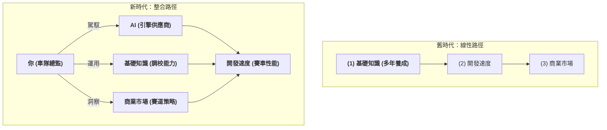
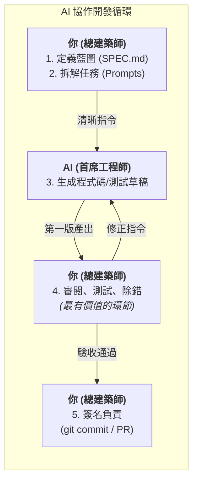

# 現代開發者的生存指南：AI 時代的內功心法與協作之道

## The Catalyst: The Core Questions

> 這份筆記源於一次自我對話，當我身處 AI 崛起的浪潮中，感受到一股強烈的「不踏實感」。我將當時腦中的困惑與掙扎，整理成了以下五個核心問題：  
<em>#chaos</em>、<em>#自我詰問</em>、<em>#AI協作</em>
>
> > 坦白說我雖然是工程師，但我對於前端知識不是很了解 
> > 雖然現在能靠AI agent做出一定程度的功能與規模，但就是有總不踏實的感覺 
> > 忽然有很多種想法  
> > Q1. 寫APP就像造車子一樣，我不一定要每個東西都很懂，現在有AI可以很快速地開發出功能，但產品如果要繼續變得更好或者要維護時，感覺就會有難度 
> > Q2. 還是得打好基礎知識，雖然短時間內可以開發很快，但感覺不是長久之計 
> > Q3. 但是那麼多觀念跟知識，哪學得完？反正APP能做出來最重要，技術是其次，要懂得商業市場才是關鍵（？） 
> > 現在這個時代的開發跟以前不一樣了，一行一行慢慢敲，哪趕得上AI？ 
> > Q4. 關於開發APP，我該掌握哪些重要的底層知識？那麼多語法跟框架 
> > 我要學什麼才是最重要的，就像內功心法一樣，一法通萬法通？
> > Q5. 如何跟AI協通開發可以更快更順利? 
>
> 以下的內容，就是我為了解答這些問題，所總結出的一套應對未來挑戰的心態模型與行動策略。

---

## 一、速度、基礎、商業的「不可能三角」

過去，開發者需要在「開發速度」、「基礎知識」、「商業市場」三者之間痛苦地權衡。但 AI 的出現打破了這個局面。我們的新角色不是「造車工匠」，而是**「F1 車隊總監」**。

-   **工匠 (舊時代)**: 必須精通每一個零件的製造。
-   **車隊總監 (新時代)**: 目標是贏得比賽。他善用頂級供應商（AI）提供的引擎，但必須依靠自己的**基礎知識**來做調校，並運用**商業策略**來贏得比賽。

> **結論：** AI 不是讓你三選一，而是讓你三者兼得的催化劑。

---

## 二、不變的內功心法：一法通，萬法通

框架和語法是外功招式，瞬息萬變。真正重要的，是支撐所有招式的內功心法。對於前端 App 開發，四大內功是：

1.  **狀態管理 (State Management)**
    * **核心**: 所有互動的本質。理解「狀態」是什麼，以及如何可預測地管理它的變化。

2.  **組件化架構 (Component-Based Architecture)**
    * **核心**: 學會如何將複雜的介面「拆解」成獨立、可複用的「積木」，然後再「組合」起來。

3.  **非同步流程 (Asynchronous Flow)**
    * **核心**: 理解 **Promise** 和 **`async/await`**，掌握處理「等待」和「互動」的藝術，這是應對網路請求、使用者輸入等非同步事件的關鍵。

4.  **客戶端與伺服器互動 (Client-Server Interaction)**
    * **核心**: 了解 App 如何透過 API 與世界溝通，獲取和提交數據。

> 掌握這四大心法，任何新框架都只是新瓶裝舊酒。

---

## 三、AI 協作之道：總建築師與首席工程師 SOP

與 AI 高效協作的關鍵，是明確和 AI 的角色分工。

-   **你**: 總建築師 (負責思考與決策)。
-   **AI Agent**: 首席工程師 (負責執行與實作)。

**標準作業程序 (SOP):**
1.  **你，定義藍圖**: `SPEC.md` 的清晰度，決定了 AI 產出的準確度。
2.  **你，拆解任務**: 將大功能拆解成 AI 能理解的單一、清晰的 Prompt。
3.  **AI，產出草稿**: AI 負責完成 80% 的模板和基礎程式碼。
4.  **你，審閱與除錯**: 你的核心價值在於**判斷** AI 產出的品質，**解讀**測試失敗的原因，並**引導** AI 修正。
5.  **你，簽名負責**: 最終的 `git commit` 和 PR 是你的作品，你對品質負最終責任。

---

## 結論：從「程式碼實現者」到「產品建構者」

那份「不踏實感」，是你正在蛻變的信號。你不再只是一個被動實現需求的工程師，而是在主動地**駕馭 AI、運用基礎知識、思考商業價值，來建構一個完整產品的創造者**。

這條路，就是未來十年最有價值的開發者所走的路。