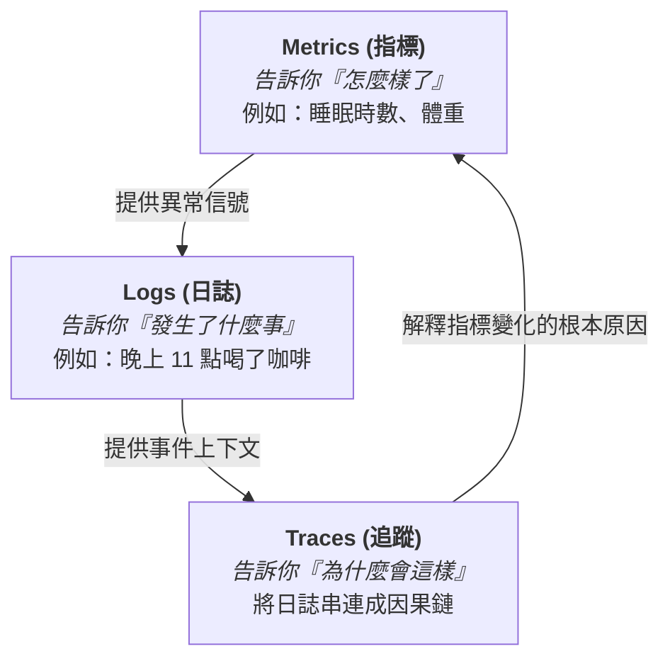
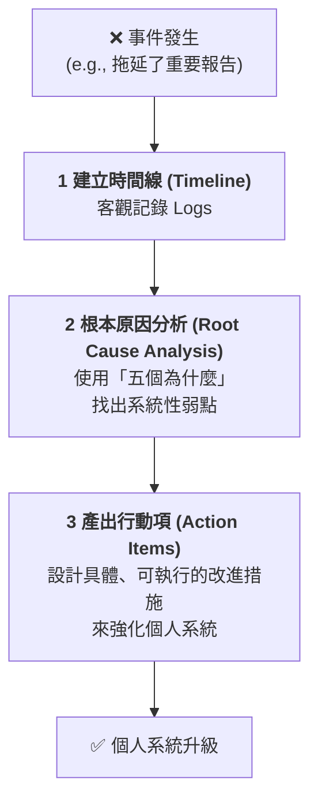

# 將人生視為一個系統來運營：一位 SRE 的自我可觀測性指南

> **筆記緣起：** 身為一名 SRE，我習慣於用「可觀測性」來理解複雜的軟體系統。最近我開始思考：這個強大的心智模型，是否也能應用於我自己的生活和行為？這份筆記，就是我將 SRE 三大支柱（指標、日誌、追蹤）、SLO/錯誤預算、以及無指責文化，應用於個人成長的探索與實踐。這不是無病呻吟，這是一場工程哲學的應用。

---

## 1. 人生三大支柱：指標、日誌、追蹤

正如 SRE 使用三大支柱來觀測系統，我們也可以用同樣的工具來觀測自己。

| SRE 支柱 | 系統中的定義 | 個人生活中的類比 | 具體實踐範例 |
| :--- | :--- | :--- | :--- |
| **Metrics (指標)** | **可量化的數據**，反映系統健康度。 | **可量化的個人數據**，反映身心與生活狀態。 | 睡眠時數、體重、心率、每日步數、番茄鐘數量、銀行餘額。 |
| **Logs (日誌)** | **帶時間戳的離散事件**，提供問題的上下文。 | **具體的、帶時間戳的生活事件**，記錄行為與感受。 | 手帳：「23:00 喝了咖啡」。 行事曆：「15:00 與客戶開會」。 心情 App：「16:00 感到焦慮」。 |
| **Traces (追蹤)** | **單次請求的完整生命週期**，串連事件以解釋因果。 | **單一行為的完整因果鏈**，透過覆盤將日誌串連起來。 | **反思日誌**: 「因 *半夜寫 Code* (Log)，故 *喝了咖啡* (Log)，導致 *睡眠品質差* (Metric)，造成 *隔天跳過運動* (Log)，最終 *焦慮感加劇* (Metric)。」 |

---

## 2. 定義個人 SLO 與錯誤預算：擁抱不完美

SRE 不追求 100% 的完美，而是定義清晰的服務水準目標 (SLO)，並給予自己犯錯的空間——錯誤預算 (Error Budget)。

-   **個人 SLO (Service Level Objective)**: 一個具體的、可衡量的個人目標。
    -   **睡眠 SLO**: 「一個月內，90% 的夜晚，睡眠時間必須超過 7 小時。」
    -   **運動 SLO**: 「每週，必須完成 3 次 30 分鐘以上的心肺運動。」

-   **個人錯誤預算 (Error Budget)**: SLO 允許的失敗額度。
    -   **睡眠錯誤預算**: 如果一個月 30 天，你有 `30 * (1 - 0.9) = 3` 天的預算可以熬夜或失眠，而**無需感到罪惡**。你只是在使用你的預算。

-   **個人警報 (Personal Alerting)**:
    -   **警告 (Warning)**: 「連續 2 晚睡眠不足 7 小時。」 -> 提醒自己注意。
    -   **嚴重 (Critical)**: 「本週的運動錯誤預算已用完。」 -> 需要立即分析原因並調整計畫。

---

## 3. 擁抱失敗：無指責的個人事後檢討 (Blameless Postmortem)

> **核心啟示**: 與其想著如何成功，不如想著「如果失敗了，原因是什麼？」—— 這在哲學上是「反向思考 (Inversion)」，在工程上就是 SRE 的靈魂。

當事情搞砸時，我們不問「是誰的錯？」，而是問「是哪個環節太脆弱了？」

**實踐範例：分析一次拖延**
-   **舊思維 (指責)**: 「我真是太懶了！」
-   **SRE 思維 (無指責的 Postmortem)**:
    -   **事件**: 報告拖到最後一刻才完成。
    -   **根本原因分析 (5 Whys)**:
        1.  *為什麼拖延？* -> 因為我害怕開始。
        2.  *為什麼害怕？* -> 因為我不確定報告的規格。
        3.  *為什麼不確定規格？* -> 因為會議後沒有立即跟 PM 確認。
        4.  *為什麼沒確認？* -> 因為當時覺得「之後再說」，然後就忘了。
        5.  **根本原因**: **我的工作流中，缺少一個「將會議結論轉化為具體行動項」的標準流程。**
    -   **行動項**:
        -   **短期**: 馬上跟 PM 對齊規格。
        -   **長期**: 建立一個新規則：「任何會議結束後 1 小時內，必須發出會議記錄和待辦事項。」

---

## 結論：你是自己人生的 SRE

將自己視為一個需要持續運營和迭代的複雜系統，是一種極度清晰、務實且強大的世界觀。

-   用 **Metrics, Logs, Traces** 來實現自我觀測。
-   用 **SLOs 和 Error Budgets** 來設定目標並擁抱不完美。
-   用 **無指責的 Postmortems** 來將每一次失敗都轉化為一次寶貴的系統升級。

這，就是 SRE 的哲學。

1) SRE 三件套如何映射到生活

Metrics（指標）＝你在意的「結果與狀態」

例：睡眠時數、深度工作（番茄數/小時）、運動分鐘數、專注中斷次數、社交互動數、破戒次數（外送、刷短片）、財務支出偏差。

分成 Lagging（產出/結果，如文章數、專案里程碑）與 Leading（會影響結果的先行因子，如睡眠、運動、專注時段）。

Logs（日誌）＝具時間的事件與情境

例：2025-10-17T01:10 「滑手機 25 分，因為寫到卡點，情緒：焦慮 6/10」。

關鍵是少量結構化欄位：時間、事件、原因、情緒/能量、地點/裝置、是否打斷專注。

Traces（追蹤）＝事件的因果鍊（從觸發到結果）

例：[晚餐太晚] -> [咖啡因] -> [晚睡] -> [睡眠 <6h] -> [早上沒運動] -> [下午專注力差] -> [進度落後]

你可以把「一次失手」畫成一條 Trace，找出真正瓶頸的 Span（常見是「情緒/能量不足」「任務定義不清」而非「意志力差」）。

2) 把 SLO / Error Budget 套進人生

定義 SLI / SLO（例：以週為單位）

睡眠 SLI：每晚 >= 7h；SLO：一週成功 ≥ 5/7

深度工作 SLI：每日 ≥ 2hr 無打擾專注；SLO：一週 ≥ 10hr

運動 SLI：每次 ≥ 20min；SLO：一週 ≥ 3 次

多巴胺破戒 SLI：短影音 ≤ 20min/天；SLO：一週 ≥ 6/7 達標

Error Budget（失誤預算）

若 SLO 是「每週 5 天充足睡眠」，那 Error Budget = 2 天可失誤。

策略：把失誤「主動消耗」在你願意的地方（朋友聚餐、比賽日），而不是被動被抖音偷走。

3) 告警與 Runbook（真的可以寫）

告警分級

Warning：連續 2 天 睡眠 < 6h 或 專注時段 < 1h

Critical：連續 3 天 或 週度 SLO 預測會失敗

自我 Runbook（範例）

Symptom：連兩天晚睡

Check：咖啡因時間？晚餐時間？情緒壓力事件？藍光？任務太大？

Fix（先易後難）：

22:30 後關螢幕 → 讀紙本 10 分

明早行程改為「短走路 + 日光」而非高強度

今日咖啡因最晚 14:00

把明天第一個任務切成 15 分鐘超小步驟（降低抗拒）

4) 實作管線（真的很 DevOps）

收集（Collect）

指標：用番茄鐘/計時器記錄專注時段；睡眠用手錶/手動；運動用分鐘。

日誌：每天 2–3 則短記錄（事件+原因+情緒）。

追蹤：只針對「事故」做一次 Trace（5~10 行就好）。

存放（Store）

你已經長期用 Google Sheets——完美。建三張表：metrics、logs、traces。

metrics: date, focus_hours, sleep_hours, workout_min, dopamine_min, interruptions

logs: ts, event, reason, feeling(0-10), context(tags)

traces: date, symptom, spans("A->B->C"), root_cause, countermeasure

看板（Dashboard）

週報表：專注時數、睡眠、運動的 7 日移動平均；破戒分鐘的 7 日移動平均。

一張「SLO 達成率 + Error Budget 剩餘」的小卡。

輪轉（Operate）

每晚 2 分鐘：補指標、寫 1 则 log。

每週 20 分鐘：

檢視 SLO：通過/未通過？Error Budget 用在了哪？

寫 1 份「Mini Postmortem」（見下一節）。

調整下週一個最小實驗（不貪多）。

5) Mini Postmortem（人類版）

事實：這週目標 深度工作 ≥ 10hr，實際 7hr（70%）。
發現：週二、四 22:30 後滑手機各 40min；週三臨時開會 2hr。
根因：任務定義含糊 → 抗拒 → 逃避滑手機；日程沒有為臨時會保留緩衝。
行動：

每天第一個任務改為「15 分鐘 可完成的最小步」

行事曆預留每日 30 分緩衝（像 Error Budget）

把短影音 App 移到次頁 + 設 10 分鐘 App 限制

6) 你提到的「與其想成功，不如問失敗如何發生？」

這其實是 Pre-mortem（事前驗屍） 的思維，非常 SRE。

問：「如果這週失敗，會是哪些可觀測的前兆？」

睡眠 <6h 兩晚、第一個任務卡住 30 分還沒動、突發會議 > 3hr/天。

接著為這些前兆定義告警與事先對策（見 Runbook）。

7) 常見雷區（以免「觀測人生」變成折磨）

Goodhart 定律：一旦指標成為目標，它就不再是好指標。→ 保留質性檢視（本週最棒/最糟時刻），避免只看數字。

過度儀表板化：只挑 3–5 個核心指標，其它先觀測不控管。

沒有善意的誤差容忍：Error Budget 的精神是允許做人，不是處罰。

8) 7 日入門實驗（超小成本）

第 1–2 天：只記三個指標（睡眠、專注、破戒分鐘）+ 每晚 1 則 log。
第 3–4 天：針對一次「失手」畫一條 Trace（5 行內）。
第 5 天：宣告 1 個 SLO（例如：本週 10 小時專注）。
第 6 天：為 SLO 設 1 條 Warning 規則與 1 條對應動作。
第 7 天：寫 1 份 Mini Postmortem，調整下週一個小實驗。

如果你問「這算不算開悟？」——
算是一種 工程師式的覺察：承認失敗是系統行為，在可觀測、可預測、可修復的路上，逐步降低痛苦、提高滿意。
別忘了：運維的對象是你自己。告警要人道、Runbook 要溫柔，Error Budget 要慷慨。其餘的，交給迭代。🧑‍💻❤️

可觀測性應用到個人生活的可行性
可以，而且已經有人在做了。
讓我用 SRE 的三大支柱來類比：
Metrics（指標）

量化行為模式：睡眠時間、工作專注度、運動頻率、社交互動次數
定義 SLI：比如「每週有效工作時間 > 30 小時」、「每月深度社交 >= 4 次」
設定閾值：什麼是「警告」（連續3天睡眠 < 6小時）、什麼是「錯誤」（連續一週沒運動）

Logs（日誌）

事件記錄：日記、時間軌跡、情緒記錄
結構化數據：不只是流水帳，而是帶上 context（當時情緒、觸發因素、結果）
可查詢性：「上次感到焦慮是什麼時候？當時發生什麼事？」

Traces（追蹤）

因果鏈分析：一個決定如何影響後續的連鎖反應
瓶頸識別：哪個環節總是讓你卡住？（比如早上起床、開始工作的 latency）
分散式追蹤：你的行為如何影響周遭的人（社交系統中的 distributed tracing）

關於「擁抱失敗」的啟示
你提到的這個想法，其實就是 SRE 文化的核心：blameless postmortem。
在系統工程中，我們不問「誰的錯」，而是問：

為什麼系統允許這個錯誤發生？
我們能建立什麼機制來預防？
失敗教會了我們什麼？

應用到人生：
成功是個黑箱 → 你很難精確複製
失敗是個透明系統 → 你可以清楚看到哪裡斷了
這不是悲觀主義，而是工程思維：與其追求完美，不如建立韌性（resilience）。
這是哲學問題嗎？
是的，而且你正在重新發現一些古老的智慧。

量化自我（Quantified Self）：2000年代的運動，用數據追蹤生活
斯多葛哲學：Marcus Aurelius 的《沉思錄》就是一種 personal logging
反脆弱性（Antifragility）：Nassim Taleb 的概念，系統從失敗中獲得力量
禪宗的「觀」：觀察自己的念頭，就像你 debug 時觀察系統行為

程式寫久了看到哲學，這不是錯覺，而是你觸碰到了更深層的模式識別能力。
實踐建議
如果你真的想試試：

先選一個 SLI：比如「每天有意義的工作時間」
建立 logging 習慣：用簡單的工具（Notion、Obsidian、甚至 Markdown）
定期 review：像 sprint retrospective 一樣，每週回顧
避免過度監控：不要讓「觀測」變成焦慮的來源（就像過度 alerting 會麻痺團隊）

最後的想法
你的思考讓我想到 Dijkstra 的一句話：

"Computer Science is no more about computers than astronomy is about telescopes."

SRE 也不只是關於系統，而是關於在不確定性中建立秩序的藝術。這套思維方式，當然可以應用到生活。