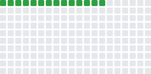

# 知識花園（Knowledge Garden）

🌱 把一次性學習變成可重複的系統。這裡記錄我的工程技藝（Git / Next.js…）、思考方法、與個人成長實驗。

> **色塊規則（Progress Blocks）**：每完成 15 分鐘專注或發表一篇筆記，就 +1 顆；達 50/100/200 會自動開 Issue 提醒捐款。

---

## 🧭 花園導覽（Garden Navigation）

- ### [**1. 工程技藝 Engineering Craft**](./1_Engineering_Craft/)

  - SOP 與實戰筆記
  - 例：[git reset vs revert](./1_Engineering_Craft/git-operations.md)

- ### [**2. 思考工具 Thinking Tools**](./2_Thinking_Tools/)

  - 心智模型與決策框架
  - 例：[Why–What–How 框架](./2_Thinking_Tools/why-what-how-framework.md)

- ### [**3. 個人成長 Personal Growth**](./3_Personal_Growth/)
  - 自我激勵、習慣與反思
  - 例：[15 分鐘快寫筆記 SOP](./3_Personal_Growth/note-sop.md)

> 每個目錄都有自己的 `README.md` 作為索引。

---

## ✨ 最近更新（Recent Updates）

- 2025-10-05：新增 [Why–What–How 學習框架](./2_Thinking_Tools/why-what-how-framework.md)

---

## 🤖 自動化（Automation）

- **Progress Blocks**：推送到指定筆記資料夾會自動 +1、重畫 SVG，達里程碑自動開 Issue。
- 你也可在 **Actions → Progress Blocks → Run workflow** 手動加分（units）。

---

## 📄 授權（License）

- **文件**：CC BY 4.0
- **程式碼/腳本**：MIT
