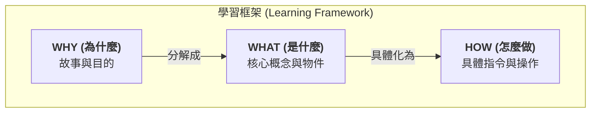

# 學習框架：Why-What-How 三層法

這是我用來學習複雜概念（特別是程式設計與軟體工程）的核心心智模型。它幫助我從宏觀到微觀，建立一個穩固且不易忘記的知識體系，避免陷入死記指令的困境。

### 核心理念的視覺化

---

### 什麼是 Why-What-How 框架？

這是一個 Top-Down 的學習方法，將知識拆解為三個層次：

1.  **🌍 WHY - 故事層**: 這是最高層次的視角。理解一個工具或概念**為何存在**，它要解決的根本問題是什麼。這是建立長期記憶和直覺的基礎。
2.  **🧩 WHAT - 概念層**: 在理解了故事背景後，進一步拆解構成這個故事的**核心名詞和它們之間的關係**。這是建立知識地圖的過程。
3.  **🛠️ HOW - 操作層**: 這是最底層的細節。學習**具體的操作指令**來驅動和使用在「WHAT」層定義的概念。這些是我們最容易忘記，但也最容易查詢的部分。

---

### 實戰案例：用三層法學習 Git

#### 🌍 WHY - Git 的故事

> **問題背景**: 一個人開發時，程式碼改壞了想還原怎麼辦？多個人一起開發時，如何合併彼此的程式碼才不會天下大亂？
> **解決故事**: 我們需要一個「版本控制系統」，就像程式碼的「時光機」。Git 就是目前最流行的時光機軟體。而 GitHub 則是一個雲端服務，專門用來存放這些「時光機」的備份，並提供協作平台。

#### 🧩 WHAT - Git 的核心概念

- **倉庫 (Repository / Repo)**: 存放你專案所有檔案和歷史紀錄的地方。
  - **本地倉庫 (Local Repo)**: 在你自己的電腦上。
  - **遠端倉庫 (Remote Repo)**: 在 GitHub 雲端上。
- **提交 (Commit)**: 你對專案做的一次「存檔」動作，會產生一個獨一無二的版本快照。
- **分支 (Branch)**: 為了開發新功能或修復 bug 而建立的獨立工作線，不會影響到主線 (`main`)。
- **合併 (Merge)**: 將一個分支的修改內容，合併到另一個分支。
- **拉取請求 (Pull Request / PR)**: 在 GitHub 上，請求你的團隊成員審核你的分支，並同意將其合併到主線的正式流程。
- **作者身份 (Authorship)**:
  - **簽名 (Git Config)**: `git commit` 時，蓋在你提交上的姓名郵箱，證明**作者**是誰。
  - **鑰匙 (SSH Key)**: `git push` 時，用來向 GitHub 證明你**有權限**操作遠端倉庫。

#### 🛠️ HOW - Git 的常用指令

- **建立地基 (Setup)**

  - `git clone [URL]`: 從遠端複製一個專案到本地。
  - `git init`: 在本地初始化一個空倉庫。
  - `git remote add origin [URL]`: 連接本地倉庫和遠端倉庫。
  - `git config --global user.name "..."`: 設定你的簽名。

- **日常開發 (Daily Workflow)**

  - `git checkout -b [branch-name]`: 建立並切換到一個新分支。
  - `git add .`: 將所有修改加入到「暫存區」，準備提交。
  - `git commit -m "message"`: 正式「存檔」，建立一個 commit。
  - `git status`: 查看目前的專案狀態。

- **與遠端同步 (Syncing)**
  - `git push origin [branch-name]`: 將你本地的 commit 推送到遠端。
  - `git pull origin [branch-name]`: 從遠端拉取最新的 commit 到本地。
  - `git fetch`: 查看遠端倉庫的最新狀態，但不立即合併。

---

### 💡 延伸應用與技巧

#### 常見的陷阱 (Common Pitfalls)

1.  **混淆 SSH Key 和 Git Config**: 記住「鑰匙 vs. 簽名」的比喻。一個管通訊，一個管署名。
2.  **`main` vs. `master` 分支名稱混淆**: 現代 Git 的預設主分支是 `main`。如果遇到舊專案或不同的 Git 設定，可能會是 `master`。
3.  **忘記 `git pull`**: 在開始動工前，養成先 `git pull` 拉取最新程式碼的習慣，避免衝突。

#### 最佳實踐 (Best Practices)

- **有意義的 Commit Message**: 遵循 [Conventional Commits](https://www.conventionalcommits.org/) 規範 (例如 `feat:`, `fix:`, `docs:`)，讓你的提交歷史清晰可讀。
- **使用 `.gitignore`**: 建立 `.gitignore` 檔案，告訴 Git 忽略 `node_modules` 等不需要版本控制的檔案。
- **小步快跑，頻繁提交**: 不要等到寫了一千行程式碼才做一次 commit。完成一個小功能，就做一次 commit，讓版本歷史更細緻。
